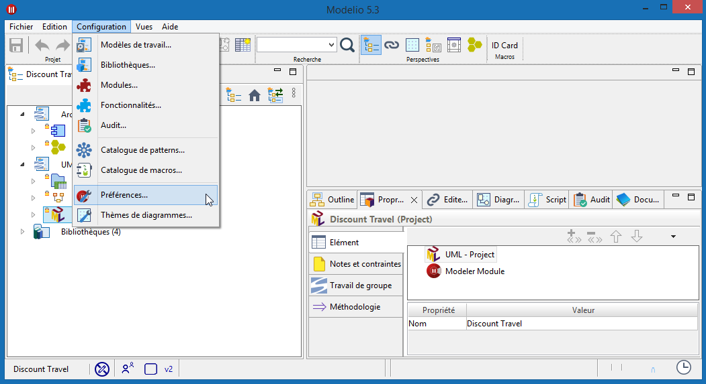
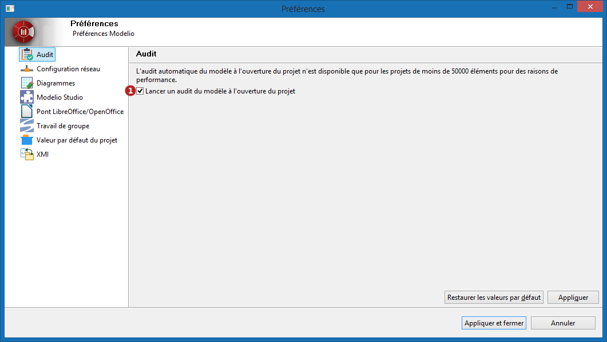
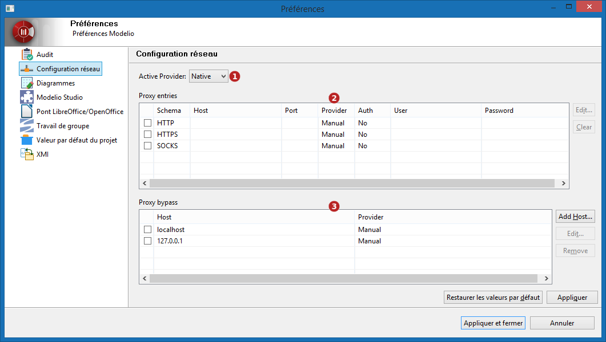
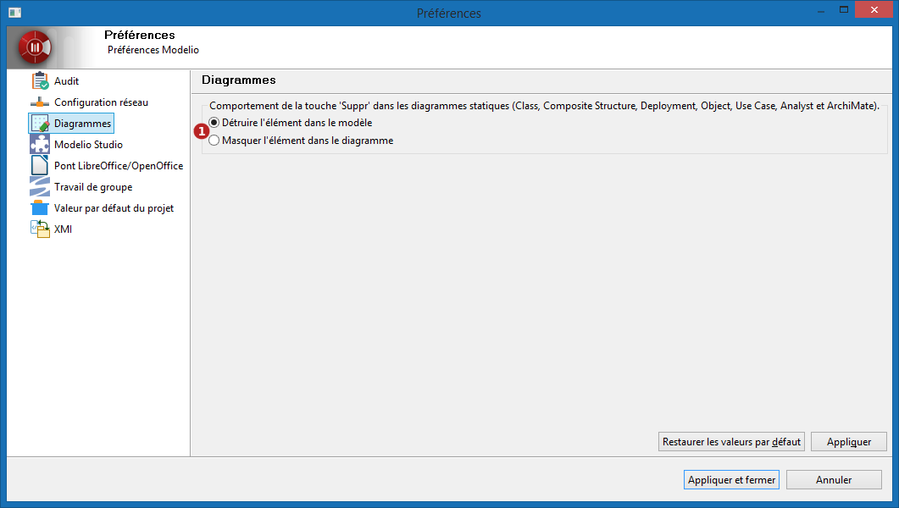
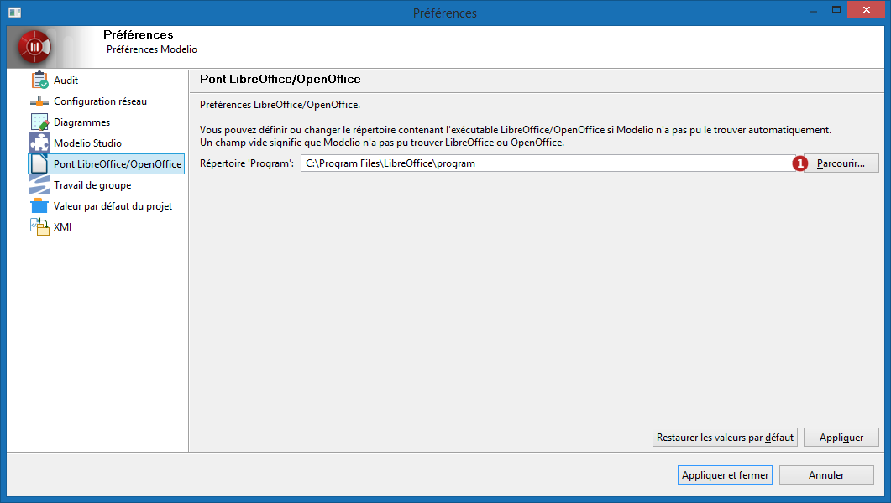
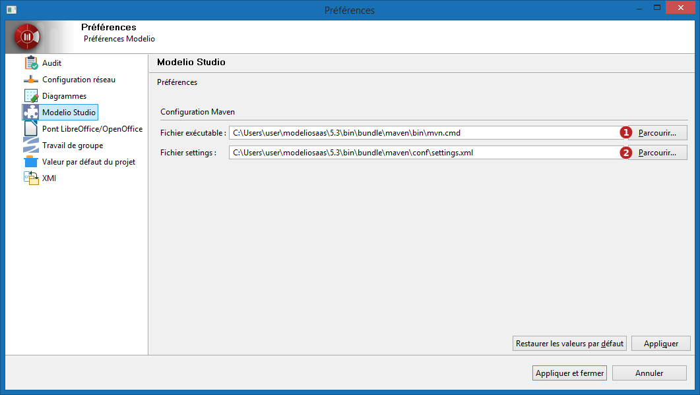
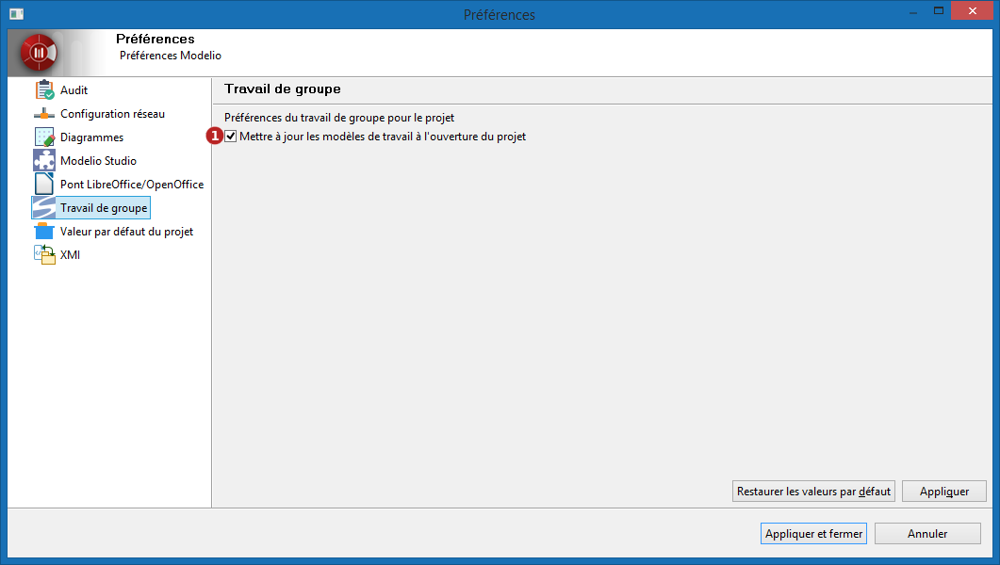
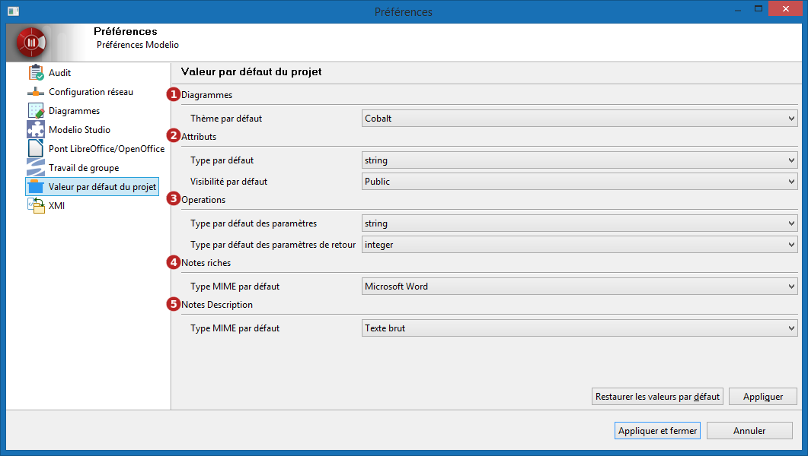
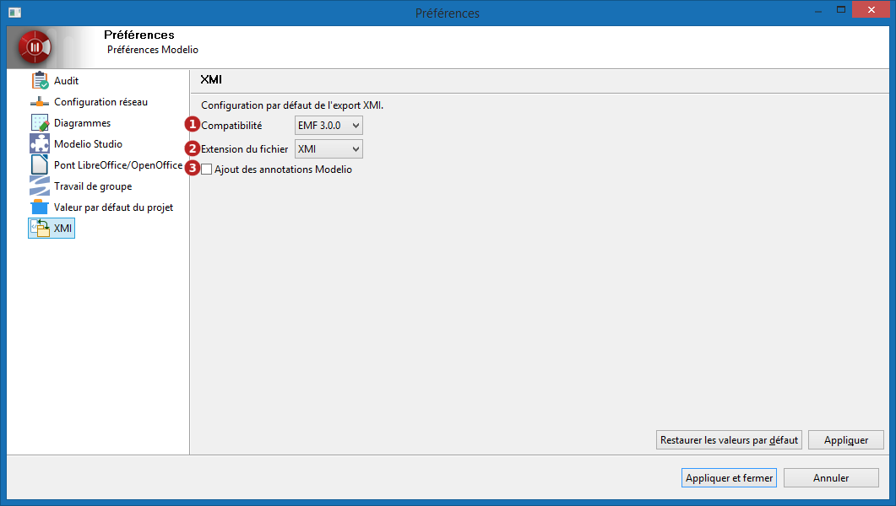

// Disable all captions for figures.
:!figure-caption:
// Path to the stylesheet files
:stylesdir: .

= Préférences Modelio

Des paramètres supplémentaires peuvent être consultés et modifiés depuis la fenêtre de 'Préférences' .

Pour accéder aux préférences de Modelio, allez dans le menu 'Configuration > Préférences' .

La fenêtre de préférences est organisée en sections. La liste des sections est sur le panneau de gauche et son contenu coté droit.

== Audit

*Légende :*

. Choisissez si Modelio doit ou non lancer un audit de modèle à l'ouverture du projet.

*Note :* cette option n'est disponible que pour les projets de moins de 50 000 éléments afin d'éviter les problèmes de performances.

== Configuration du réseau

La section *Configuration réseau* vous permet de configurer la connexion à un serveur proxy.

*Légende :*

. Dans " *Fournisseur actif* ", vous pouvez choisir :
* *Direct* : Sélectionnez "Direct", si vous n'avez pas besoin de passer par un proxy pour accéder aux réseaux.
* *Manuel* : Sélectionnez "Manuel", si vous avez besoin de définir manuellement les paramétrages.
* *Natif* : Sélectionnez "Natif", si vous voulez utiliser le paramétrage du système d'exploitation. +
. *Entrées de proxy* +

La table affiche les entrées qui sont disponibles pour tous les "Fournisseurs". La case à cocher de la 1ère colonne indique que l'entrée est utilisée par le "Fournisseur" actuellement sélectionné.

Si vous avez sélectionné "Manuel" comme "fournisseur actif", 3 schémas sont disponibles pour configurer: HTTP, HTTPS and SOCKS. La configuration de chaque schéma est affichée dans la table "Proxy entries". Pour éditer la configuration d'un schéma, double-cliquez sur l'entrée ou sélectionnez l'entrée et cliquez sur le bouton "Editer...". Si le champ "Port" est vide, ce sera le numéro du port par défaut qui sera utilisé. +
Les numéros des ports par défaut pour chaque schémas prédéfinis sont :

* HTTP : 80
* SSL : 443
* SOCKS : 1080 +

. *Contournement du proxy*

Utilisez cette table pour spécifier les noms d'hôtes avec lesquels il ne faut pas utiliser le proxy. Une connexion directe sera toujours utilisée pour trouver les hôtes. +
La case à cocher de la 1ère colonne indique que l'entrée est utilisée par le "Fournisseur" actuellement sélectionné.

== Diagrammes

*Légende :*

. Choisir quel comportement Modelio doit utiliser quand la touche 'Suppr' est utilisé dans les diagrammes statiques :
* Supprimer l'élément du modèle et le retirer du diagramme.
* Le retirer du diagramme uniquement.

*Note :* cette option n'est pas prise en compte dans les diagrammes dynamiques (Activity, Communication, State Machine, BPMN et Sequence).

== Pont LibreOffice/OpenOffice

Vous avez la possibilité de définir le chemin vers le répertoire contenant l'exécutable LibreOffice ou OpenOffice, au cas où Modelio n'arrive pas à le trouver automatiquement, ou si vous souhaitez utiliser l'une de ces applications plutôt que l'autre.

. Cliquez sur le bouton 'Parcourir' pour modifier le chemin vers le dossier 'program' de la suite Office.

== Modelio Studio

*Légende :*

. Choisir l'éxecutable maven à utiliser pour la compilation de modules personnalisés.
. Définir quel fichier de configuration maven utiliser pour la compilation de modules personnalisés.  +  

  Le fichier par défaut fourni avec Modelio référence les référentiels maven de la version courante de l'application sur modelio.org.

== Travail de groupe

*Légende :*

. Choisissez si Modelio doit ou non lancer une mise à jour sur tous les modèles de travail partagés à l'ouverture du projet.

== Valeurs par défaut du projet

La section *Valeurs par défaut du projet* vous permet de définir les valeurs par défaut lors de la création de nouveaux éléments.

*Légende :*

. *Diagrammes* : Définit le thème utilisé lors de la création de nouveaux diagrammes.
. *Attributs* : Définit le type et la visibilité lors de la création d'attributs.
. *Opérations* : Définit le type des paramètres et le type de retour de l'opération.
. *Notes riches* : Définit le format (et l'éditeur en conséquence) des notes riches créées via l'éditeur tabulaire.
. *Notes Description* : Définit le type MIME (texte brut ou HTML) pour les notes "Description"

== XMI

La section *XMI* vous permet de définir plusieurs options pour vos opérations d'import / export XMI.

*Légende :*

. *Compatibilité* : Choisir entre un fichier compatible avec la spécification EMF 3.0.0 ou les spécifications UML 2.1.1, UML 2.2, UML 2.3 ou UML 2.4.1 de l'OMG.
. *Extension du fichier* : Préciser l'extension qui sera donnée aux fichiers exportés (".xmi" ou ".uml")
. *Ajout des annotations Modelio* : Définir si la compatibilité maximum est activée lors de l'exécution d'une opération de ré-import dans Modelio.
