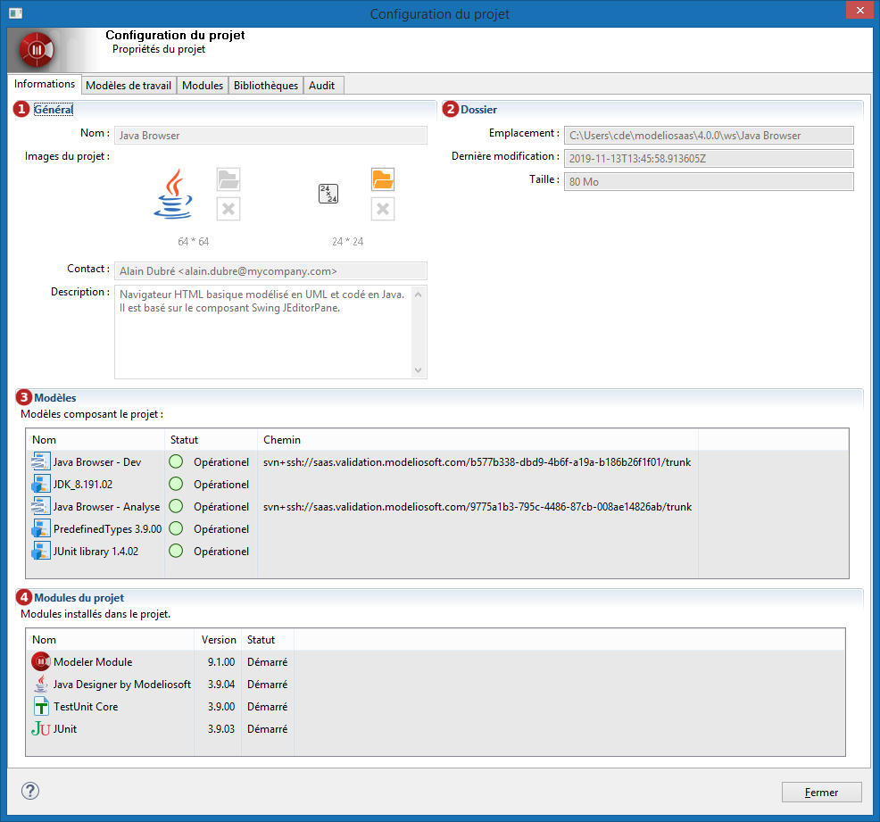

// Disable all captions for figures.
:!figure-caption:
// Path to the stylesheet files
:stylesdir: .

= Consulter les informations du projet

Afin d'obtenir des informations sur le projet ouvert, il suffit d'ouvrir la 'Configuration du projet' en cliquant sur le bouton image:images/attachment/modeliocom41/User_Documentation_fr/Project_SaaS/Consulting_project_information_SaaS/ConsultingProjectInformation_002.png[ConsultingProjectInformation_002.png].

*Légende :*

1. Informations générales sur le projet. 
2. Informations relatives au stockage physique du projet. 
3. Liste des modèles contenus dans le projet. 
4. Liste des modules déployés dans le projet.
