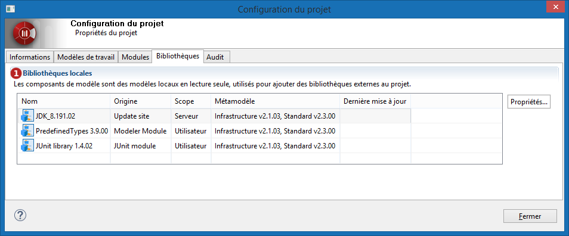

// Disable all captions for figures.
:!figure-caption:
// Path to the stylesheet files
:stylesdir: .

= Consulter les bibliothèques du projet

Une *bibliothèque de modèle* est un ensemble d'éléments de modèle non-modifiables nécessaires au développement de votre projet, packagés dans un seul et unique artéfact.

Un exemple très basique pour les projets Java est le JDK. Afin de modéliser correctement une application Java, plusieurs classes du JDK sont utilisées, soit pour l'extension par l'héritage, soit comme composants des compositions et associations de votre modèle. Ces classes du JDK sont emmenées dans votre projet par une *bibliothèque de modèle*. Votre but n'est évidemment pas d'éditer ou de modifier le modèle du JDK, pour cette raison, les modèles fournis par les bibliothèques sont toujours en *lecture seule*.

Pour avoir des détails sur les bibliothèques déployées dans un projet, sélectionnez l'onglet *Bibliothèques* de la fenêtre de *Configuration du projet* accessible depuis le bouton image:images/attachment/modeliocom41/User_Documentation_fr/Project_SaaS/Consulting_project_libraries_SaaS/ConsultingProjectInformation_002.png[ConsultingProjectInformation_002.png].

*Légende :*

1. Liste des bibliothèques déployées dans le projet.
