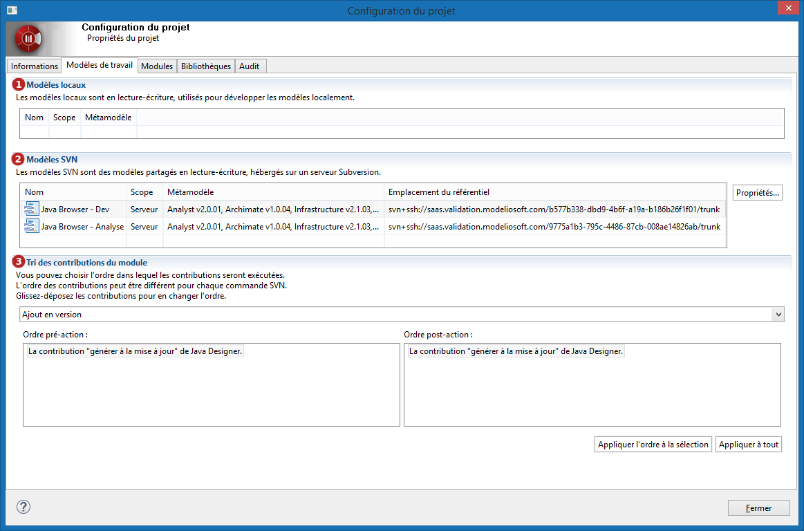

// Disable all captions for figures.
:!figure-caption:
// Path to the stylesheet files
:stylesdir: .

= Consulter les modèles de travail du projet

Dans un projet Modelio, on appelle *modèle de travail* un morceau de modèle qui peut être modifiable. +
Pour avoir des détails sur les modèle de travail d'un projet, sélectionnez l'onglet *Modèles de travail* de la fenêtre de *Configuration du projet* accessible depuis le bouton image:images/attachment/modeliocom41/User_Documentation_fr/Project_SaaS/Consulting_project_work_models_SaaS/ConsultingProjectInformation_002.png[ConsultingProjectInformation_002.png]

*Légende :*

1. Liste des modèles locaux. 
2. Liste des modèles partagés SVN. 
3. Gestion des contributions des modules aux commandes SVN.
