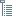
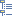

// Disable all captions for figures.
:!figure-caption:
// Path to the stylesheet files
:stylesdir: .

= Vue Documents

Présentation de la vue Documents de Modelio :

image::images/attachment/modeliocom41/User_Documentation_fr/Vue_Documents/Document_View/DocumentViewPuces.png[DocumentViewPuces.png]

La vue Documents est composée de :

1.  La liste des éléments documentaires disponibles pour l'élément de modèle sélectionné dans l'application
2.  Un rappel du contexte (c'est à dire l'élément sélectionné dont les éléments documentaires sont affichés)
3.  Une zone d'édition directe pour les notes de description, ou un aperçu pour les diagrammes et autres documents.
4.  Une barre d'outil comprenant les commandes suivantes :
1.   Attacher un document externe
2.  image:images/attachment/modeliocom41/User_Documentation_fr/Vue_Documents/Document_View/document.png[document.png] Créer un document embarqué
3.  image:images/attachment/modeliocom41/User_Documentation_fr/Vue_Documents/Document_View/adddescription.png[adddescription.png] Créer une note de description
4.  image:images/attachment/modeliocom41/User_Documentation_fr/Vue_Documents/Document_View/delete.png[delete.png] Supprimer le document sélectionné
5.   Trier les documents par ordre alphabétique
6.   Trier les documents par type
7.  image:images/attachment/modeliocom41/User_Documentation_fr/Vue_Documents/Document_View/bycategory.png[bycategory.png] Trier les documents par catégorie
