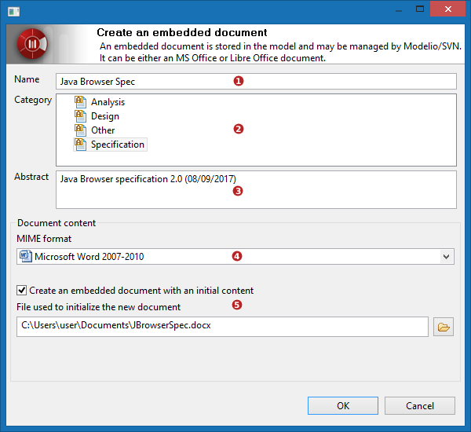

// Disable all captions for figures.
:!figure-caption:
// Path to the stylesheet files
:stylesdir: .

= Utilisation de la vue Documents

Dans la description suivante des commandes de la vue Documents, l'élément sélectionné sera noté *ELT* pour des raisons de concision.

=== Ajouter une note description à ELT

La première note description d'un élément est créée automatiquement par Modelio à la création de l'élément. La seule action requise est d'en saisir le contenu dans la zone d'aperçu.

L'utilisateur peut ajouter d'autres notes description en procédant comme suit :

1.  Cliquer sur le bouton image:images/attachment/modeliocom41/User_Documentation_fr/Vue_Documents/Using_the_Document_View/adddescription.png[adddescription.png] dans la barre d'outils de la vue Documents
2.  Une nouvelle note description apparaît dans la liste des éléments documentaires, la note est sélectionnée dans la liste
3.  Le contenu de la note peut être édité directement dans la zone d'aperçu, en mode texte brut, ou en HTML (Clic-droit sur la note dans la liste > HTML pour activer/désactiver le mode HTML)

*Conseil :* lorsqu'un élément a plusieurs notes description, l'utilisation de noms significatifs facilitera la lecture future du modèle.

Interactions supplémentaires pour les notes description: ::

1.  *clic-droit* sur une note description dans la liste des éléments documentaires de la vue Documents : commandes de copie, destruction, changement de mode HTML/Texte brut
2.  *double-clic* sur une note description dans la liste des éléments documentaires de la vue Documents : affichage de la boîte d'édition des propriétés de la note dans laquelle la note *peut être renommée*
3.  *F2* sur une note description dans la liste des éléments documentaires de la vue Documents : renommage direct de la note

=== Ajout d'un document embarqué à ELT

L'utilisateur peut ajouter des documents embarqués à ELT en suivant la procédure suivante :

1.  Cliquer sur le bouton  dans la barre d'outils de la vue Documents
2.  La fenêtre "Créer un document embarqué" s'affiche
3.  Remplir le formulaire et valider
4.  Un nouveau document apparaît dans la liste des éléments documentaires, il est sélectionné dans la liste et la zone d'aperçu affiche son contenu

1.  *Nom du document* : saisir le nom du document +
_Choisir un nom court et significatif._
2.  *Catégorie* : choisir une catégorie de document +
_Ceci permettra de trier les éléments documentaires et donne une indication sur l'objet du document._ +
Les catégories proposées dépendent de la configuration du projet (modules). Par défaut, il s'agit de :
* Analyse
* Conception
* Spécification
* Autre
3.  *Résumé* : court texte résumant le contenu du document et son rôle.. +
_Le résumé apparaîtra dans le tooltip de l'élément documentaire dans la liste de la vue Documents._ +
_Il sera aussi affiché lorsque le document sera démasqué dans un diagramme._
4.  *Format MIME* : les formats MIME disponibles dépendent des applications présentes sur le poste de travail.
* MS Office: Word, Excell, Power Point, etc.
* Libre/Open Office: Writer, Calc, Presentation, etc.
5.  *Créer un document embarqué avec un contenu initial* : cocher cette case pour initialiser le contenu du nouveau document avec celui d'un document initial fourni. +
_Cocher cette option fait apparaître un champ d'initialisation dans lequel on saisi le chemin du document initial. Le contenu du document initial sera copié dans le nouveau document._

=== Attacher un document externe à ELT

L'utilisateur peut attacher n'importe quel type de document à ELT en suivant l'une de ces deux procédures :

Procédure 1 - commande de la barre d'outils ::

1.  Cliquer sur le bouton image:images/attachment/modeliocom41/User_Documentation_fr/Vue_Documents/Using_the_Document_View/attachdocument.png[attachdocument.png] dans la barre d'outils
2.  La boîte de dialogue "Attacher un document externe" s'affiche
3.  Remplir le formulaire et valider
4.  Une nouvelle référence de document apparaît dans la liste des éléments documentaires de la liste. Elle est sélectionnée dans la liste et la zone d'aperçu affiche son contenu (lorsque le format est compatible)

Procédure 2 - Glisser-déposer ::

1.  Sélectionner l'élément de modèle auquel on veut attacher un document externe
2.  Glisser-déposer un fichier depuis un explorateur de fichiers vers la vue Documents
3.  La boîte de dialogue "Attacher un document externe" s'affiche
4.  Remplir le formulaire et valider
5.  Une nouvelle référence de document apparaît dans la liste des éléments documentaires de la liste.

image::images/attachment/modeliocom41/User_Documentation_fr/Vue_Documents/Using_the_Document_View/AttachAnExternDocument371Puces.png[AttachAnExternDocument371Puces.png]

1.  *Fichier/URI à référencer* : saisir la référence du document à attacher à ELT. +
_La référence est un chemin vers un fichier qu'on peut saisir directement ou en cliquant sur le bouton  pour parcourir le disque ou le réseau._
2.  *Nom du document* : saisir le nom du document +
_Choisir un nom court et significatif. Si laissé vide, le nom du fichier/URI sera utilisé._
3.  *Catégorie* : choisir une catégorie de document +
_Ceci permettra de trier les éléments documentaires et donne une indication sur l'objet du document._ +
Les catégories proposées dépendent de la configuration du projet (modules). Par défaut, il s'agit de :
* Analyse
* Conception
* Spécification
* Autre
4.  *Résumé* : court texte résumant le contenu du document et son rôle.. +
_Le résumé apparaîtra dans le tooltip de l'élément documentaire dans la liste de la vue Documents._ +
_Il sera aussi affiché lorsque le document sera démasqué dans un diagramme._ +

=== Edition d'un document d'ELT existant

L'édition d'un document dépend de sa nature (externe ou embarqué). Un document ne peut pas être édité dans la zone d'aperçu.

===== Notes description

Les notes de description peuvent être éditées dans la zone d'aperçu, en texte brut ou HTML à condition que l'élément auquel elles sont attachées soit accessible en écriture (pas dans un RAMC ou locké par le CMS).

===== Documents embarqués

1.  Double-cliquer sur le document dans la liste
2.  Le document est ouvert dans un éditeur dédié à condition que le format soi supporté par le système.
3.  Editer le document dans l'éditeur et sauvegarder

===== Diagrammes

La liste des éléments documentaires affiche les diagrammes directs et liés à ELT. Une indication est fournie via l'icône du diagramme dans la liste (externe ou lié).

Pour ouvrir/éditer un diagramme, double-cliquer sur lui dans la liste des éléments documentaires.

===  Détruire un élément documentaire

Détruire un élément documentaire est conditionné au fait que l'élément lié est accessible en écriture.

Il suffit de sélectionner un élément documentaire dans la liste et de presser la touche "Suppr" ou de cliquer sur le bouton image:images/attachment/modeliocom41/User_Documentation_fr/Vue_Documents/Using_the_Document_View/delete.png[delete.png] dans la barre d'outils.

Qu'est-ce qui est détruit exactement ? ::

* pour une note de description : +
_la note est détruite et retirée du modèle_
* pour un document embarqué : +
_le document est détruit, son contenu est perdu_
* pour un document externe : +
_seule la référence est détruite, le document externe reste intact_
* pour un diagramme ^1^ +
_le diagramme lui-même est détruit et retiré du modèle_

^1^ pour des raisons de sécurité et pour éviter des destructions non-intentionnelles, détruire un diagramme depuis la vue Documents n'est autorisé que pour les diagrammes directs. La commande n'est pas disponible pour les diagrammes liés.
