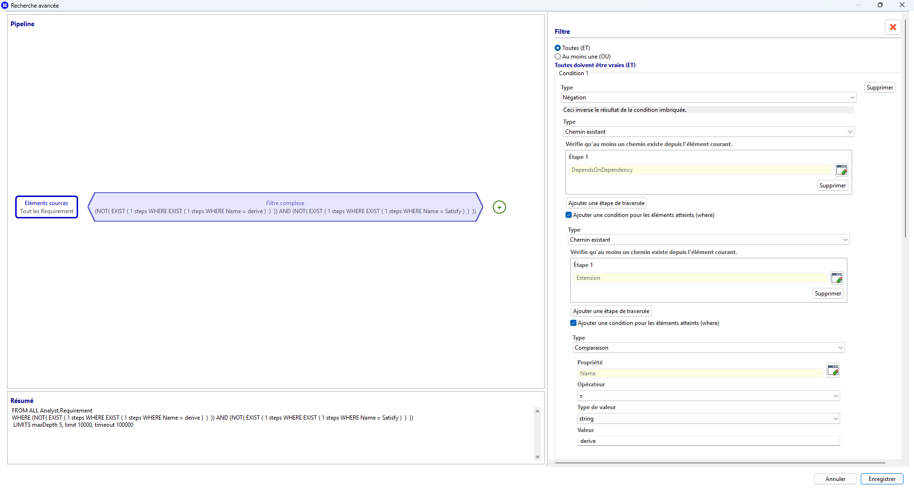
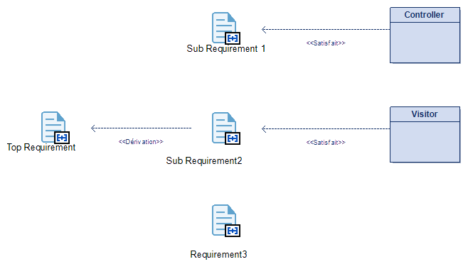
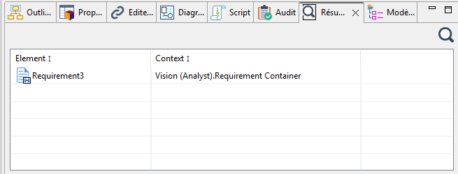

// Disable all captions for figures.
:!figure-caption:
// Path to the stylesheet files
:stylesdir: .

= Définition d'une requête MQL

== Introduction

L'éditeur de requête MQL permet de construire et de modifier des requêtes de manière graphique. 
Il repose sur une logique de pipeline: l'utilisateur définit une source de départ, puis enchaîne des étapes de navigation, de filtrage, de répétition ou de branchement, jusqu'à obtenir un parcours de recherche cohérent et exécutable.

== Description fonctionnelle

Cet assistant de création est organisé en deux zones principales. 

La partie gauche contient le pipeline graphique ainsi qu'une zone de résumé. 

 - Le pipeline représente visuellement la source puis les différentes étapes de traitement. 
 - La zone de résumé donne une reformulation lisible de la requête en cours de construction.
 
La partie droite contient un panneau de propriétés contextuel: son contenu change automatiquement *selon l'élément sélectionné dans le pipeline*. 
Si rien n'est sélectionné, le panneau affiche les propriétés générales de la requête, notamment son nom et ses limites d'exécution. 
Si par exemple, la source est sélectionnée, le panneau permet de définir le mode d'alimentation de la requête. 

image::images/query_view_general.png[Vue de l'éditeur de requête MQL]

== Fonctionnement

=== 1. Pipeline graphique

Le pipeline graphique constitue le coeur de l'outil de définition. 
Il représente visuellement l'enchaînement des opérations appliquées aux éléments du modèle de la droite vers la gauche.

- Le noeud de source *unique et obligatoire* définit le point de départ de la requête.
- Les différents noeuds d'étape représentent les opérations successives appliquées à cette source.
- Les zones d'ajout marquées par un symbole d'ajout permettent d'insérer une nouvelle étape dans le flux principal, dans une branche d'union ou dans le corps d'une répétition.
- La sélection d'un noeud pilote l'affichage du panneau de propriétés contextuel situé à droite.
- La suppression d'une étape peut se faire directement au niveau de l'étape sélectionnée.

[Vue du pipeline MQL]image::images/query_view_pipeline.png[]

=== 2. Propriétés générales d'une requête MQL

Lorsqu'aucun noeud d'étape n'est sélectionné, l'outil affiche une interface de paramétrage global.

- Le champ de nom permet d'identifier la requête enregistrée.
- Les champs limites permettent de contrôler la profondeur maximale, le nombre maximal de résultats et le temps maximal d'exécution.

Cette fenêtre sert à définir le cadre global d'exécution de la requête.

image::images/query_view_conf.png[Configuration d'une requête MQL]

=== 3. Définition de la source

Lorsque la source est sélectionnée, un panneau spécifique permet de définir l'origine des éléments traités.

- Le mode "tous les éléments d'un type" permet de choisir une métaclasse comme point de départ global.
- Le mode "source fournie" indique que les éléments d'entrée proviendront de la sélection active dans l'environnement Modelio.
- Un sélecteur de métaclasse permet d'affiner le type de départ lorsque la recherche porte sur tous les éléments d'un type donné.
- Une zone de messages remonte les diagnostics associés à la définition de la source.

Ce panneau sert donc à fixer précisément l'ensemble initial sur lequel la requête va travailler.

image::images/query_view_source_all.png[Définition de la source d'une requête MQL

=== 4. Navigation ou traversée

Lorsqu'une étape de traversée est sélectionnée, un panneau de navigation permet de définir comment la requête progresse dans le modèle.

- Un premier mode est orienté lien, avec choix d'un type de lien prédéfini.

image::images/query_view_navigate_link.png[Définition d'une navigation]

- Un second mode est orienté modèle, avec sélection ou affichage d'une relation du métamodèle.

image::images/query_view_navigate_metamodel.png[Définition d'une navigation]

- Une option de direction inverse permet de parcourir la relation dans le sens opposé.
- Des messages d'aide ou d'erreur guident l'utilisateur si la navigation n'est pas correctement définie.

Cette navigation permet de décrire la propagation d'une étape à la suivante.

=== 5. Filtrage d'expression

Lorsqu'une étape de filtre est sélectionnée, le panneau d'expression permet de construire la condition de sélection.

- Le filtre peut être simple, par exemple une comparaison de propriété.
- Il peut être typé, par exemple un test de type ou un test d'existence de chemin.
- Il peut aussi être composite, en combinant plusieurs conditions avec des opérateurs logiques.
- Le contenu du panneau s'adapte dynamiquement à la nature de l'expression en cours.

Cette étape a pour rôle de réduire ou qualifier les résultats intermédiaires produits par le pipeline.

image::images/query_view_filter_property.png[Définition d'un filtre]

=== 6. Répétition

Lorsqu'une étape de répétition est sélectionnée, un panneau dédié permet de configurer une exploration répétée.

- Une option permet de contrôler si les résultats doivent être émis à chaque profondeur ou seulement à la frontière finale.
- Le corps de la répétition peut contenir ses propres sous-étapes.
- Les sous-étapes internes peuvent à leur tour être sélectionnées et configurées dans les panneaux contextuels adaptés.

Cette étape permet d'exprimer les parcours itératifs dans le modèle.

image::images/query_view_navigate_recursive.png[Définition d'une répétition]

=== 7. Union

Lorsqu'une étape d'union est sélectionnée, un panneau permet de gérer plusieurs branches parallèles.

- Chaque branche représente un sous-parcours distinct.
- L'utilisateur peut ajouter une branche ou supprimer une branche existante.
- Le tableau des branches indique leur présence et le nombre d'étapes qu'elles contiennent.

Ceci permet de modéliser des variantes de parcours dont les résultats sont regroupés dans une même requête.

image::images/query_view_union.png[Définition d'un union]

== Cas d'utilisation

Dans le cadre d'un projet de développement, le responsable du projet veut s'assurer que toutes les exigences ont bien été prises en compte.
C'est-à-dire que soit elles ont été décomposées en sous-exigences, soit elles sont satisfaites.

Pour cela, nous allons rechercher les exigences qui ne sont liés à aucun autre élément du modéle i.e. qui n'ont pas été décomposé et qui ne sont pas satisfaite.

La figure suivante illustre la requête MQL représentant cela.

Qui dans le cadre d'un modèle simple comme celui-ci :

Ne retournera que l'exigence "Requirement3"

