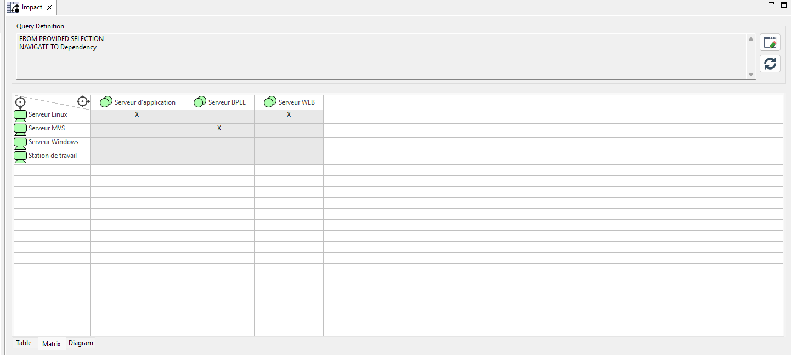
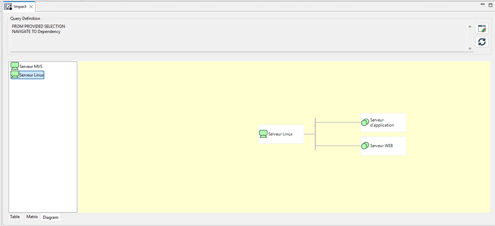
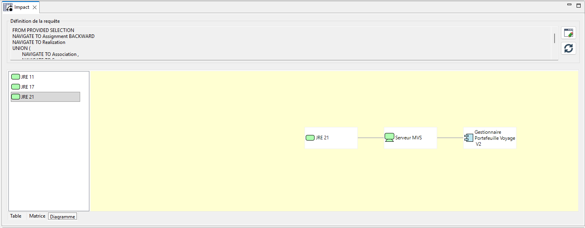

// Disable all captions for figures.
:!figure-caption:
// Path to the stylesheet files
:stylesdir: .

= L' analyse d'impact par requête

== Introduction

Une analyse d'impact est une requête MQL permettant de déterminer quels éléments d'un modèle peuvent être affectés par la modification d'un ou plusieurs éléments sources. 
Cette analyse exécute une requête MQL définie par l'utilisateur et restitue les résultats sous trois formes complémentaires : une liste tabulaire, un tableau croisé et un graphe de propagation.
Chaque visualisation du résultat de la requête permettant de mettre en valeur un aspect différent.

image::images/impact-general.png[Aperçu de l'analyse d'impact]

== Description fonctionnelle

La vue d'une analyse d'impact s'organise autour de trois concepts principaux.

Le premier concept concerne la définition des sources de l'analyse. L'utilisateur désigne les éléments du modèle à partir desquels la requête MQL doit être exécutée. 
Ces sources peuvent être ajoutées par glisser-déposer depuis l'explorateur de modèle ou pré-chargées automatiquement lors de la création de l'analyse.

Le deuxième concept est la requête MQL. Une requête MQL définit les types de relations à parcourir, leur sens de traversée et les types d'éléments à inclure dans les résultats. 
Cette requête est modifiable à tout moment et peut être réexécutée sans modifier les sources.

Enfin le troisième concept et dernier concept est la restitution des résultats. Les éléments identifiés comme impactés sont présentés sous trois onglets : Table, Matrice et Diagramme. 
Chaque onglet offre une lecture différente des mêmes données, adaptée à des usages distincts.

== Fonctionnalités

=== Configuration de l'analyse

La vue permet à l'utilisateur de définir un périmètre d'analyse propre à chaque besoin.

- Plusieurs analyses indépendantes peuvent coexister, chacune portant ses propres sources et sa propre règle de propagation.
- Les sources sont ajoutées ou retirées sans réinitialiser la requête.
- Une analyse existante peut être dupliquée pour créer une variante avec une requête différente.

=== Calcul des éléments impactés

Le moteur d'exécution calcule l'ensemble du graphe de dépendances à partir des sources définies et produit la liste complète des éléments touchés par la requête.

- Tous les éléments atteignables selon la requête sont listés.
- Le calcul est déclenché manuellement via le bouton *Actualiser*.

=== Identification des sources par élément impacté

Pour chaque élément identifié comme impacté, la vue indique quelle(s) source(s) est (sont) à l'origine de cet impact.

- Un élément peut être impacté par une ou plusieurs sources simultanément.
- Cette information est visible dans les onglets Table et Matrix.

=== Visualisation des chaînes de propagation

La vue retrace les chemins parcourus entre chaque source et les éléments impactés.

- Les relations intermédiaires traversées sont visibles dans l'onglet Diagram.
- L'utilisateur peut sélectionner une source pour afficher uniquement les chemins issus de celle-ci.

=== Gestion du périmètre

L'utilisateur peut à tout moment modifier les sources prises en compte dans une analyse.

- Une source est ajoutée par glisser-déposer depuis l'explorateur de modèle.
- Une source est retirée via le bouton *✕* de la colonne *Actions* dans l'onglet Table.
- Le calcul n'est relancé qu'à la demande, ce qui permet d'ajuster le périmètre avant d'exécuter.

== Définition des règles de propagation

=== Rôle de la requête MQL

Chaque analyse d'impact est pilotée par une requête MQL qui détermine quelles relations du modèle sont parcourues et dans quel sens. Cette requête est le seul mécanisme contrôlant l'étendue du calcul.

image::images/query_view_general.png[Spécifier les règles]

=== Composition de la requête

==== Types de relations

- L'utilisateur sélectionne les types de relations à traverser (usage, réalisation, association, déploiement…).
- Chaque type de relation peut être parcouru dans un sens défini : de la source vers la cible, ou de la cible vers la source.
- La propagation peut être limitée à certains types d'éléments pour restreindre les résultats.

==== Modification et réexécution

- La requête est modifiable à tout moment via le bouton *Edit* de la zone *Query Definition*.
- Après modification, l'utilisateur relance le calcul via le bouton *Actualiser* pour mettre à jour les résultats.
- Une analyse existante peut être dupliquée pour tester une variante de requête sans perdre la version d'origine.

== Présentation des vues de résultats

=== Vue d'ensemble

Les résultats d'une analyse sont accessibles sous trois onglets : Table, Matrix et Diagram. Ces trois vues reposent sur les mêmes données calculées et se complètent selon le niveau de détail souhaité.

image::images/impact-general.png[Visualiser les résultats]

=== Onglet Table

L'onglet Table présente les impacts sous forme de liste détaillée.

- Pour chaque source, les éléments impactés sont listés individuellement.
- Un clic sur un élément impacté permet de naviguer directement vers cet élément dans l'explorateur Modelio.
- De nouvelles sources peuvent être ajoutées par glisser-déposer depuis l'explorateur.

image::images/impact-general.png[Table analyse]

=== Onglet Matrice

L'onglet Matrice présente les impacts sous forme de tableau croisé.

- Les sources sont disposées en lignes, les éléments impactés en colonnes.
- Une marque *X* est placée à l'intersection d'une source et d'un élément qu'elle impacte.
- Cette vue permet de comparer la couverture d'impact entre plusieurs sources et d'identifier les éléments les plus exposés.

=== Onglet Diagramme

L'onglet Diagram présente les chemins de propagation sous forme de graphe.

- Le panneau gauche liste les éléments sources de l'analyse.
- Le panneau droit affiche le graphe de propagation depuis la source sélectionnée.
- Un clic sur une source dans le panneau gauche recentre le graphe sur celle-ci.

== Guide d'utilisation pas-à-pas

Cette section décrit les étapes nécessaires pour créer une analyse d'impact, définir ses règles de propagation et consulter ses résultats.

=== Étape 1 — Créer l'analyse

. Dans l'explorateur de modèle, faites un clic droit sur l'élément à analyser
  (package, composant, classe, exigence…).
. Sélectionnez *Create impact* dans le menu contextuel.

Modelio crée une nouvelle analyse. Son nom est généré automatiquement (préfixe _Impact_ + suffixe unique) ; il peut être modifié depuis l'explorateur. 
Les éléments enfants directs de l'élément sélectionné sont pré-chargés comme sources dans l'onglet *Table*. L'éditeur d'analyse s'ouvre automatiquement.

=== Étape 2 — Spécifier la requête de propagation

La zone *Query Definition* en haut de l'éditeur affiche un résumé de la requête active.

. Cliquez sur *Edit* pour ouvrir l'éditeur de requête MQL.
. Définissez les règles de propagation :
  * quels types de relations parcourir (usage, réalisation, association, déploiement…),
  * dans quel sens les traverser (source → cible, ou cible → source),
  * quels types d'éléments inclure dans les résultats.
. Validez la requête pour revenir à l'éditeur d'analyse.
. Ajoutez ou retirez des sources si besoin :
  * glisser-déposer un élément depuis l'explorateur pour l'ajouter,
  * bouton *✕* dans la colonne *Actions* pour retirer une source.

=== Étape 3 — Lancer le calcul

Cliquez sur *Actualiser* (zone *Query Definition*).

Modelio exécute la requête MQL sur l'ensemble des sources et alimente les trois onglets de résultats.

=== Étape 4 — Consulter les résultats

==== Onglet Table

L'onglet *Table* présente le détail ligne par ligne :

[cols="1,4"]
|===
| Colonne | Contenu

| *Actions*
| Bouton ✕ pour retirer la source correspondante de l'analyse.

| *Sources*
| L'élément source, avec son icône et son nom Modelio.

| *Impacted*
| Un bouton cliquable par élément impacté.
  Cliquer sur un bouton navigue directement vers cet élément dans l'explorateur Modelio.
|===

==== Onglet Matrice

L'onglet *Matrice* affiche un tableau croisé : sources en lignes, éléments impactés en colonnes, marque *X* aux intersections actives.

Cette vue permet de comparer la couverture d'impact entre plusieurs sources et de repérer les éléments les plus exposés (colonnes avec le plus de X).

==== Onglet Diagramme

L'onglet *Diagramme* est divisé en deux panneaux :

* *Panneau gauche* : liste des éléments sources de l'analyse.
* *Panneau droit* : graphe GEF représentant les chemins de propagation depuis la source sélectionnée.

Cliquer sur une source dans le panneau gauche recentre le graphe sur celle-ci.

[TIP]
====
Pour tester plusieurs stratégies de propagation sur le même périmètre, il est possible de créer plusieurs analyses (une par requête MQL) et de comparer leurs résultats.
====

== Cas d'utilisation

Dans le cadre de la maintenance d'un site web d'une agence de voyage, la DSI souhaite migrer tous les JRE déployés dans ses serveurs vers la dernière LTS.
Pour estimer le coût d'une telle migration, l'architecte principal réalise une analyse d'impact afin de déterminer quels sont les composants applicatifs possiblement impactés par la migration des JRE déployés vers une nouvelle version.

Les sources de l'analyse d'impact sont donc les JREs déployés sur un ou plusieurs serveurs. Puis depuis les serveurs, il lui faut retrouver les composants d'applications exécutés mais aussi tous les composants reliés.

La requête MQL est donc la suivante:

image::images/impact_MQL.png[La requête de l'analyse d'impact]

Une fois exécutée, nous retrouvons dans la table tous les composants applicatifs impactés par une migration.

image::images/impact_result_table.png[Résultat de l'analyse d'impact]

La table nous permet de visualiser pour chaque version de JRE quel composant applicatif est impacté.

La matrice nous représente le même résultat sous une forme plus compacte. 

image::images/impact_result_matrice.png[Matrice de l'analyse d'impact]

Il est même possible de l'enrichir pour avoir une vue plus large.

image::images/Impact_matrice_enrichie.png[Matrice de l'analyse d'impact]

Enfin la vue diagramme, nous permet de nous représenter le chemin parcouru lors du calcul d'impact.

