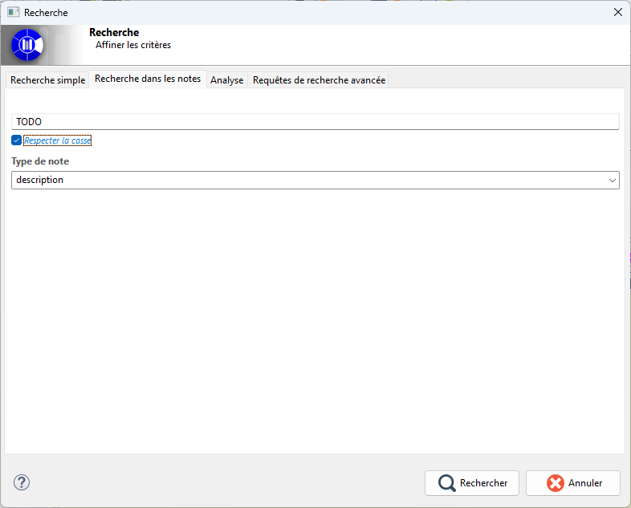

// Disable all captions for figures.
:!figure-caption:
// Path to the stylesheet files
:stylesdir: .

= Recherche dans les notes

== Introduction

La recherche dans les notes permet de retrouver rapidement les éléments du modèle à partir du contenu textuel de leurs notes. 
Elle propose une recherche simple à utiliser, combinant une expression de recherche, un choix de type de note et une option de sensibilité à la casse.

image::images/note_search_view.png[Vue de recherche dans les notes]

== Interface

Le premier champ de saisie permet de spécifier l'expression recherchée au sein des notes. L'utilisateur y renseigne le texte ou le motif à rechercher dans les notes. 
Ce champ constitue l'élément principal de la recherche. Tant que l'expression n'est pas valide (surligné en rouge) ou qu'elle reste vide, la recherche n'est pas considérée comme exécutable. 

Le deuxième champ est une option de sensibilité à la casse. Cette case à cocher permet de préciser si la recherche doit distinguer ou non les majuscules et les minuscules. 

Le troisième champ permet la sélection du type de note. Une liste déroulante propose les types de notes disponibles dans la session courante. 
Cette liste est alimentée automatiquement à partir des types de notes existants dans le modèle. 
L'utilisateur peut ainsi restreindre la recherche à une catégorie de note particulière, ou laisser le champ libre pour élargir le périmètre.

== Cas d'utilisation

Dans le cadre d'un projet d’architecture SI, les architectes documentent chaque élément du modèle (composant, interface, processus, capacité…) avec une description textuelle.
Pendant la conception, il est courant d’ajouter dans ces descriptions des marqueurs comme des TODO afin de préciser le reste à faire

Ces marqueurs sont utiles, mais ils se dispersent dans des dizaines voire des centaines d’éléments.
À mesure que le modèle grandit, il devient difficile de retrouver tous les TODOs.

Le responsable du projet fait alors régulièrement des recherches textuelles, comme dans la figure ci dessous, qui scannent toutes les descriptions du modèle afin d'avoir une idée de l'état d'avancement.

