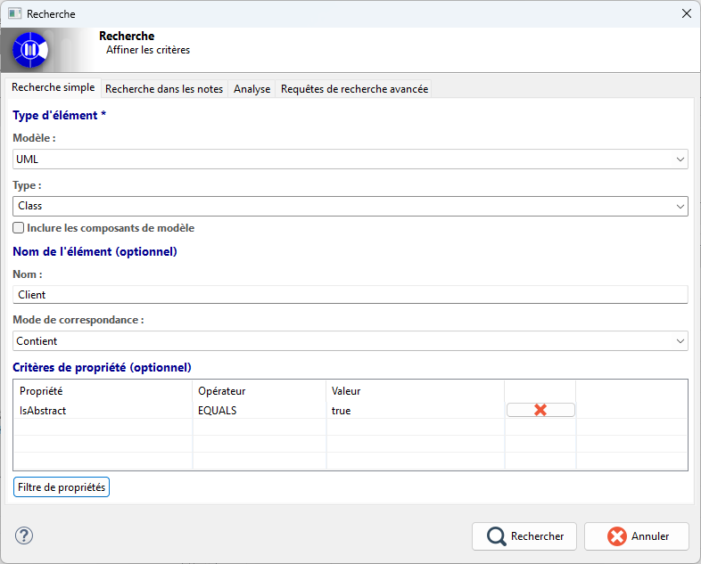
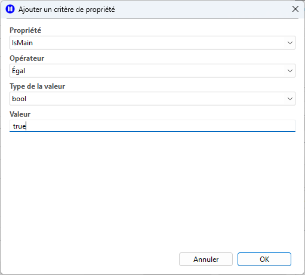

// Disable all captions for figures.
:!figure-caption:
// Path to the stylesheet files
:stylesdir: .

= La recherche simple

== Introduction

L'onglet de recherche simple permet de définir une recherche dans le modèle en combinant plusieurs filtres complémentaires. 
Ces filtres permettent de spécifier un périmètre métier, puis de le réduire grâce au nom des éléments et enfin de le contraindre par rapport aux propriétés des éléments. 

== Description

La réalisation d'une recherche dite simple repose donc sur trois concepts principaux de filtrage.

Le premier filtre concerne la spécification d'un périmètre de recherche. L'utilisateur commence par désigner la nature des éléments à rechercher. 
Ce choix fixe le domaine de validité de la recherche: il détermine quels objets peuvent être retournés, quels stéréotypes peuvent être pris en compte et quelles propriétés deviennent pertinentes pour la suite.

Le deuxième filtre, optionnel, repose sur un filtrage par motif du nom des éléments. L'ensemble des éléments appartenant au domaine de validité, spécifié précédemment, peut être restreint en vérifiant la présence ou non d'une chaine de caractère dans le nom des éléments. Ce mécanisme permet de passer rapidement d'un ensemble large d'éléments à un sous-ensemble plus ciblé grâce à leur nom.

Le troisième filtre, également optionnel, concerne l'ajout de contraintes métier sur les propriétés de l'ensemble d'éléments. Chaque critère ajouté vient compléter la recherche par une condition supplémentaire, devant toujours être vérifiée, sur une propriété disponible pour le type métier sélectionné.

La vue de recherche simple combine ces trois filtres en une recherche cohérente: le type délimite le champ d'analyse, le nom applique un filtre textuel optionnel, et les propriétés ajoutent des contraintes spécialisées. Une option complémentaire permet d'étendre ou non cette recherche aux éléments de bibliothèque.

== Fonctionnement de la recherche simple

=== 1. Le périmètre métier

La première partie de l'interface de recherche a pour but de sélectionner le type d'élément i.e. le métamodèle dont il est issu et le type d'élément

==== 1.1 La sélection du métamodèle

Cette liste déroulante permet de filtrer le métamodèle dont seront issus les éléments recherchés.

- Elle sert à exprimer la catégorie d'éléments sur laquelle la recherche va porter.
- Elle associe, lorsque c'est pertinent, un niveau de spécialisation supplémentaire par stéréotype.
- Elle conditionne la validité du reste de la définition, car une recherche sans métamodèle cible ne peut pas être interprétée correctement.
- Elle détermine aussi l'ensemble des types d'éléments qui pourront ensuite être utilisés comme critères.

==== 1.2 Définition du type

Cette liste permet de spécialiser encore plus le périmètre métier du terrain de recherche.

- Elle sert à exprimer le type exact d'éléments sur laquelle la recherche va porter.
Elle est conditionnée par le métamodèle sélectionné précédemment.
- Elle détermine aussi l'ensemble des propriétés qui pourront ensuite être utilisées comme critères.

==== 1.3 Définition de la portée de la recherche

Cette case à cocher permet de décider si la recherche doit rester limitée aux modèles ou intégrer aussi les éléments de bibliothèques (ramcs).

=== 2. Filtrage par motif du nom

Cette deuxième section de l'interface permet un filtrage par motif du nom de l'ensemble des éléments métier définis.
Cela permet de rechercher un nom exact ou seulement une approximation.
Ce filtre est optionnel, ce qui permet de l'utiliser comme un raffinement progressif plutôt que comme une contrainte systématique. Cela peut constituer un premier niveau d'affinage sémantique après le choix du type métier.

==== 2.1 Le nom

Ce champ permet de spécifier la chaine de caractère qui sera recherchée dans le nom de chaque élément.

==== 2.2 Le motif

Cette liste permet de choisir la logique de correspondance à appliquer au nom spécifié. 
Plusieurs logiques de correspondance sont possibles : "Nom exact", "Contient", "Commence par", "Se termine par".

=== 3. Les critères de propriétés

Cette troisième et dernière section de l'interface permet à nouveau d'enrichir la recherche en y ajoutant des conditions métier.

- Chaque critère exprime une condition supplémentaire appliquée à une propriété du type sélectionné qui sera obligatoirement vérifiée par les résultats.
- L'ensemble des critères forme une définition plus fine et plus discriminante que le seul filtrage par nom.
- Les critères existants peuvent être revus ou retirés à tout moment afin d'ajuster le niveau de précision attendu.

Lors d'un changement du périmètre métier, qui rend les critères de propriétés incohérents, ils sont supprimés pour préserver la validité de la recherche.

=== 4. Définition d'un critère de propriété

La capture ci-dessous représente la fenêtre de spécification guidée d'une contrainte métier élémentaire.

Elle permet de:

- Choisir une propriété compatible avec le type d'élément recherché.
- Associer cette propriété à un opérateur de comparaison adapté.
- Qualifier la nature de la valeur utilisée pour la comparaison.
- Garantir qu'un critère n'est ajouté que lorsqu'il est suffisamment défini pour être interprété par le moteur de recherche.

== Cas d'utilisation

Nous présentons ici un exemple d'utilisation de la recherche simple afin d'illustrer son fonctionnement.

Supposons que nous ayons un modèle de classe et que nous souhaitions nous assurer qu'il n'existe aucune classe abstraite dont le nom commence par le suffixe "Abstract". 
En effet, il existe plusieurs conventions de nommage des modèles de classe. Il peut, par exemple, être convenu de préfixer les classes abstraites par le suffixe "Abstract" ou non. 
Mais le fait d'avoir le nom d'une classe non Abstraite commençant par "Abstract" peut être confusant. Nous allons donc nous assurer que tel n'est pas le cas.

Pour cela, nous allons donc:

- Chercher toutes les classes du modèle
- Filtrer celles dont le nom commence par "Abstract"
- Vérifier que la propriété "IsAbstract" est fausse.

image::images/abstract_class_search.png[Recherche des classes abstraites]