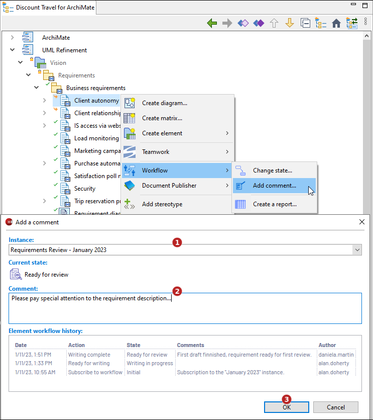
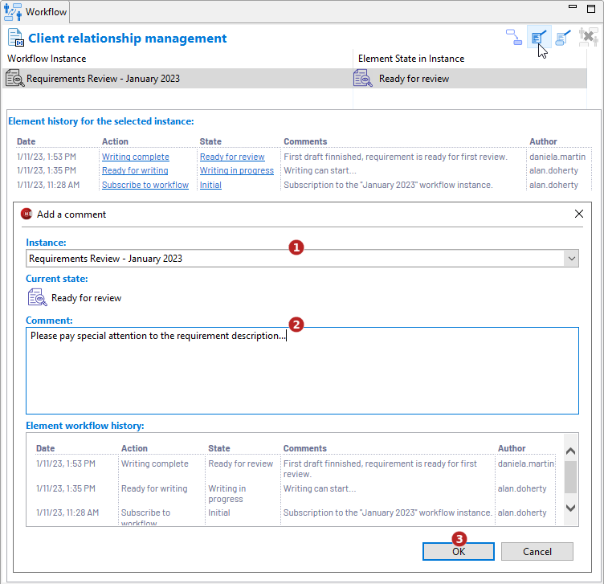

// Disable all captions for figures.
:!figure-caption:
// Path to the stylesheet files
:stylesdir: .

// Hightlight code source and add the line number
:source-highlighter: coderay
:coderay-linenums-mode: table

= Ajouter un commentaire

Cette commande n'est applicable que sur les éléments inscrits dans un workflow.
Elle permet de saisir un commentaire pour l'élément dans son état courant sans modifier ce dernier.

Le commentaire sera ajouté à l'historique du workflow de l'élément.

=== Depuis l'explorateur de modèle

Sélectionnez un élément éligible puis lancez la commande *image:images/workflowicon.png[]Workflow > Ajouter un commentaire...* :

1.  Sélectionnez une instance de workflow (seulement si l'élément est inscrit dans plusieurs instances, sinon l'instance unique est automatiquement préselectionnée)
2.  Saisissez un commentaire. Par exemple l'action en cours sur l'élément.
3.  Cliquez sur "OK".

=== Depuis la <<WorkflowUserPropertyView.adoc#,vue Workflow>>

Sélectionnez un élément éligible puis cliquez sur le bouton *Ajouter un commentaire...* :

1.  Sélectionnez une instance de workflow (seulement si l'élément est inscrit dans plusieurs instances, sinon l'instance unique est automatiquement préselectionnée)
2.  Saisissez un commentaire. Par exemple l'action en cours sur l'élément.
3.  Cliquez sur "OK".
