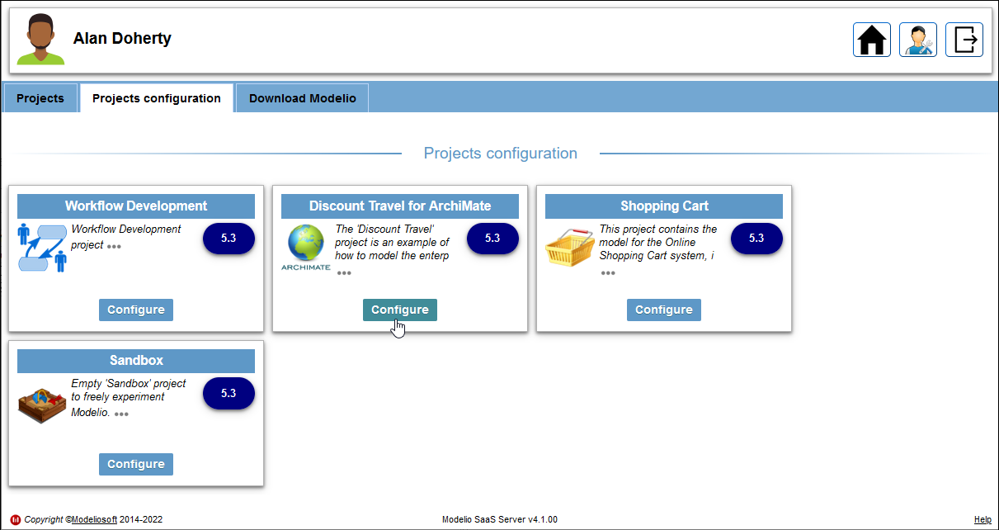
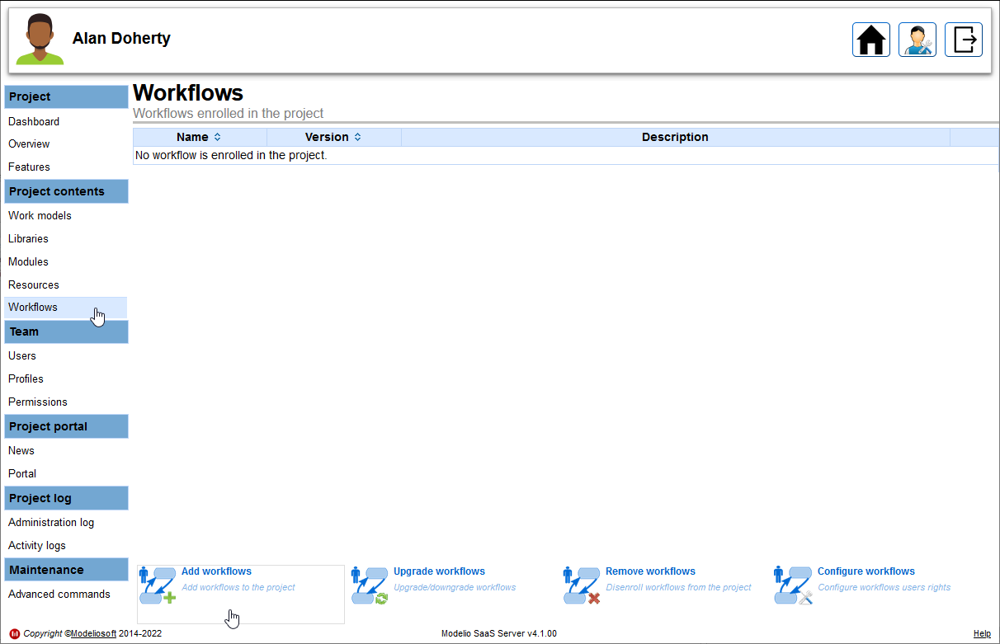
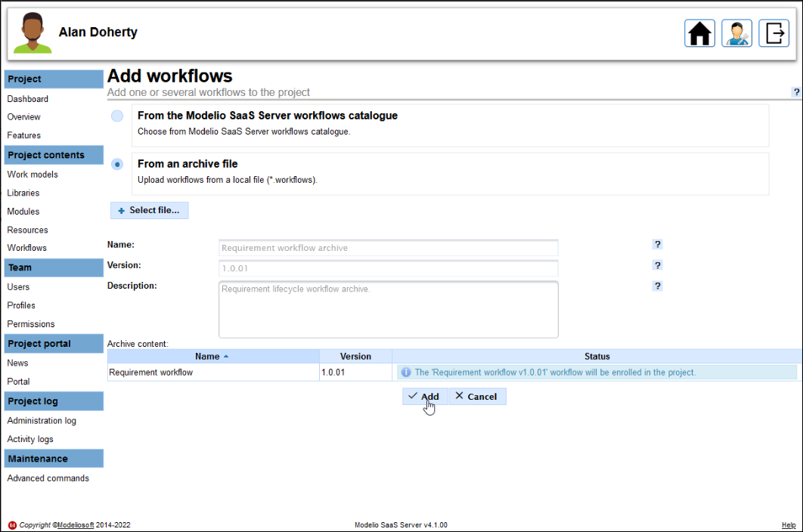

// Disable all captions for figures.
:!figure-caption:
// Path to the stylesheet files
:stylesdir: .

// Hightlight code source and add the line number
:source-highlighter: coderay
:coderay-linenums-mode: table

= Ajout d'un workflow dans un projet Modelio Server

L'ajout d'un workflow dans un projet géré par Modelio Server s'effectue depuis la page de configuration du projet.

Pour ajouter un workflow, veuillez suivre la procédure suivante :

* Connectez-vous au serveur en tant qu'administrateur du projet, puis cliquez sur le bouton *Configurer* du projet :

* Allez dans la section *Contenu du projet > Workflows* puis cliquez sur le bouton *Ajouter des workflows* : 

* Sélectionnez l’option *Depuis un fichier* et chargez votre <<PackageWorkflow.adoc#,archive de workflows pour Modelio Server>> (extension .workflows) ou alors sélectionnez l'option *Depuis le catalogue de workflows de Modelio SaaS Server* et choisissez un workflow dans la liste, puis cliquez sur le bouton *Ajouter* :

Maintenant que le workflow a été ajouté dans votre projet, vous pouvez <<NotificationsAndRightsConfiguration.adoc#,configurer ses permissions et ses notifications>> .
