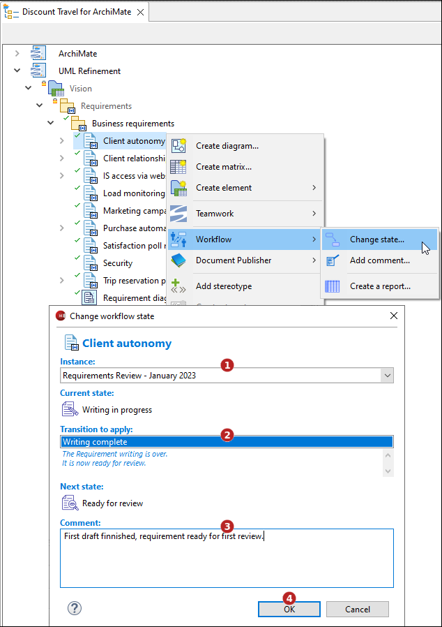

// Disable all captions for figures.
:!figure-caption:
// Path to the stylesheet files
:stylesdir: .

// Hightlight code source and add the line number
:source-highlighter: coderay
:coderay-linenums-mode: table

= Changer l'état d'un élément

Cette commande n'est applicable que sur les éléments inscrits dans un workflow.
Elle consiste à exécuter une transition sur un élément, le faisant ainsi passer de son état courant à un autre état du workflow.
Seules les transitions autorisées par les <<NotificationsAndRightsConfiguration.adoc#,permissions définies>> pour chaque utilisateur peuvent être sélectionnées.

=== Depuis l'explorateur de modèle

Sélectionnez un élément éligible puis lancez la commande *image:images/workflowicon.png[]Workflow > Changer d'état...* :

1.  Sélectionnez une instance de workflow (seulement si l'élément est inscrit dans plusieurs instances, sinon l'instance unique est automatiquement préselectionnée)
2.  Sélectionnez la transition à effectuer. Seules les transitions autorisées pour l'utilisateur courant seront sélectionnables.
3.  Saisissez un commentaire. Par exemple la raison pour laquelle l'état de cet élément a changé.
4.  Cliquez sur "OK".

=== Depuis la <<WorkflowUserPropertyView.adoc#,vue Workflow>>

Sélectionnez un élément éligible puis cliquez sur le bouton * Changer d'état....* :

image::images/ChangeStateButton.png[]

1.  Sélectionnez une instance de workflow (seulement si l'élément est inscrit dans plusieurs instances, sinon l'instance unique est automatiquement préselectionnée)
2.  Sélectionnez la transition à effectuer. Seules les transitions autorisées pour l'utilisateur courant seront sélectionnables.
3.  Saisissez un commentaire. Par exemple la raison pour laquelle l'état de cet élément a changé.
4.  Cliquez sur "OK".

