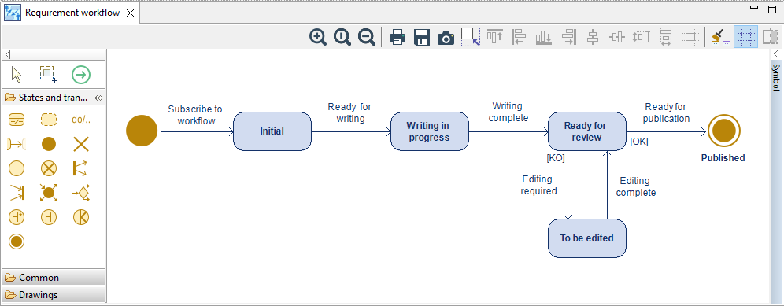

// Disable all captions for figures.
:!figure-caption:
// Path to the stylesheet files
:stylesdir: .

// Hightlight code source and add the line number
:source-highlighter: coderay
:coderay-linenums-mode: table

= Concepts

Ce chapitre passe en revue les principaux concepts utilisés et mis en oeuvre par Modelio Workflow. +
Ces principaux concepts sont :

. Élément de modèle géré par un workflow
. État
. Transition, transition possible, transition permise
. Définition d’un workflow
. Instance de workflow
. Process général d’utilisation de Modelio Workflow.

== Elément de modèle géré en workflow

Un élément de modèle géré en workflow est un élément de modèle dont on souhaite gérer et suivre l’état dans le cadre d’un workflow particulier.
Cet élément doit être préalablement inscrit ou enregistré auprès du workflow considéré afin de posséder un état dans ce workflow.

Lors de l’enregistrement d’un élément de modèle dans un workflow, l’état de l’élément de modèle est « Initial » qui est alors l’état courant de l’élément de modèle.
Ceci est vrai pour tous les workflows. Par la suite les transitions d’état qui interviendront modifieront cet état courant pour faire évoluer l’état de l’élément de modèle.

Dans un modèle, seuls certains éléments seront en pratique gérés en Workflow.
En effet, tous les éléments d’un modèle ne requièrent pas une gestion de leur cycle de vie.
En général, la gestion du cycle de vie d’un élément dans un modèle n’a de pertinence que pour les éléments de haut niveau, typiquement des packages,
composants ou autres artefacts.
Ces éléments sont en général complexes parce que constitués de nombreuses parties et autres sous-éléments.

Par exemple, un designer de processus BPMN ne s’intéressera probablement pas au cycle de vie de chaque activité du processus mais plutôt au processus
dans son ensemble : _dev en cours_, _prêt pour les tests_, _validé_, etc…

Toutefois, Modelio Workflow n’impose pas de limite « à priori » sur la nature des éléments gérables en Workflow dès lors que ces éléments sont susceptibles
d’être stéréotypés c’est-à-dire en pratique qu’il soient des ModelElement. Cette contrainte technique liée aux moyens de modélisation utilisées en interne
par Modelio Workflow n’a pas d’impact sur l’expérience utilisateur.

== Etat

Lorsqu’un élément est géré en Workflow, il possède à chaque instant un état appelé son *état courant*.
Les états possibles sont en nombre fini pour un Workflow donné, cette liste d’états possibles constituant la base même de la *définition du Workflow*.
Le concepteur du Workflow choisit normalement des état significatifs et pertinents pour le cycle de développement et la méthodologie utilisés.

== Transition

Une transition représente le changement de l’état courant E1 d’un élément de modèle géré par le workflow W à un autre état E2.
On notera les règles suivantes :

. L’état E1 appartient par définition au workflow W
. L’état E2 appartient également au workflow W, ce qui signifie qu’il n’existe pas de transitions inter-workflow
. Tous les états possibles du workflow ne sont pas systématiquement accessibles depuis un état E courant donné. C’est le principe et l’intérêt la gestion en Workflow :
ne permettre  que certaines transitions et ainsi guider et ordonnancer les évolutions de l’élément de modèle.

== Définition d’un Workflow

La définition d’un workflow est pour l’essentiel le graphe des états et transitions possibles applicables à un élément soumis à ce workflow.
Le workflow définit ainsi, outre les états possibles, les transitions permettant de passer d’un de ces états à un autre d’entre eux.
La figure ci-dessous montre un exemple de workflow pour un document soumis à un cycle de revue avant publication :

.Un exemple de workflow de revue de document.

Sur ce Workflow on peut suivre l’évolution du document et son cycle de revue. Les rectangles correspondent aux états, les flèches aux transitions possibles.

Ainsi un document peut passer de l’état « Rédaction en cours » à l’état « Prêt pour revue », ce qui sera probablement fait par le rédacteur lorsqu’il considérera
que son travail de rédaction est terminé et que le document peut être revu.
En revanche ce même rédacteur ne peut pas passer l’état du document directement à « Publiable » car aucune transition n’existe entre « Rédaction en cours »
 et « Publiable ».

Dans le cadre de l’application de ce workflow, il est vraisemblable qu’un intervenant avec le rôle de relecteur pourra, après relecture du document,
choisir de mettre le document dans l’état « A corriger » ou « Publiable » selon le résultat de la relecture.
On voit apparaître ici une notion importante dans l’exploitation d’un workflow, à savoir qu’une transition possible n’est pas forcément réalisable par n’importe quel acteur.

Au niveau du vocabulaire nous distinguerons ces deux situations en parlant de transition *possible* lorsqu’il s’agit du graphe et de transition *autorisée* (ou *permise*)
lorsque les droits de l’utilisateur entrent en ligne de compte. On remarquera qu’une transition autorisée est toujours une transition possible mais que la réciproque n’est pas vraie.

== Diversité des Workflows

Les méthodes de travail susceptibles de bénéficier de l’exploitation d’un workflow, sont nombreuses et diversifiées, au moins autant que les métiers
et les organisations qui les mettent en œuvre. En effet, chaque métier, chaque organisation a ses méthodes de travail, sa méthodologie, ses besoins propres.

Les définitions de workflow dépendent pour d’essentiel :

* De l’intention et du domaine métier : contenu du workflow, états et transitions définissant le suivi à réaliser.
*	Du domaine d’application : types d’éléments de modèle supportés.

Modelio Workflow permet de définir à volonté autant de workflows différents que nécessaires.
Ces workflows sont d’abord modélisés par un "concepteur de workflow" puis déployés dans les projets où ils sont nécessaires.

== Réutilisation des workflows – notion d’instance de workflow

Il est possible et recommandé de réutiliser une définition de Workflow dans plusieurs contextes :

* Dans différents projets.
* À différents moments dans un projet donné.
* Sur différentes parties d’un même projet.

Le premier cas, réutilisation dans plusieurs projets, ne pose pas de problèmes particuliers car les projets sont séparés sans intersection.

Les deux autres cas justifient de distinguer la définition d’un workflow, qui en liste les état et transitions, de son utilisation.

Illustrons ceci par un exemple simple : ::

_Dans le cadre d’un projet, on définit un workflow « Validation » simplissime à quatre états : initial, à valider, validé OK, validé KO.
On souhaite utiliser ce workflow pour suivre la validation d’une partie du modèle notée P1.
Plus tard, alors que le workflow est utilisé sur P1, on souhaite utiliser ce workflow de validation sur d’autre éléments de modèle constituant une partie P2 du
modèle sans que ce cycle de validation de P2 n’interfère avec ce qui se passe sur P1. Il nous faut alors différencier les deux contextes d’utilisation de notre
workflow de validation, ce que nous pouvons et devons faire en utilisant des instances (ou occurrences) différentiables du workflow de validation._

Une instance de workflow est donc une occurrence particulière d’un workflow, définie par :

* Le type de workflow (définition) à appliquer
* Les éléments qui y sont soumis
* Un nom et une description qui permettent de distinguer l’instance.

<<<
Dans notre exemple: ::

_On créera d’abord une instance de workflow nommée par exemple « Validation partie 1), typée par le workflow « Validation »
et dans laquelle nous inscrirons les éléments de modèle de P1. Par la suite nous créerons une deuxième instance de workflow nommée « Validation partie 2),
typée elle aussi par le workflow « Validation » et dans laquelle nous inscrirons les éléments de modèle de P2.
Ainsi à tout moment il sera possible de consulter et analyser le modèle sous l’angle de la « Validation partie 1 » ou sous celui de la « Validation la partie 2 »._

== Mise en œuvre d’un workflow dans un projet

La mise en œuvre d’un workflow dans un projet passe par les phases suivantes :

. Identification et obtention du workflow à utiliser
** Soit un workflow existant sur étagère
** Soit développement d’un workflow "custom".
. Déploiement du workflow dans le(s) projet(s).
. Création d’une ou plusieurs instances de ce workflow.
. Utilisation des instances du workflow  dans le projet par les utilisateurs :
** Application de transitions
** Etablissement de rapports
** Génération de documents.

