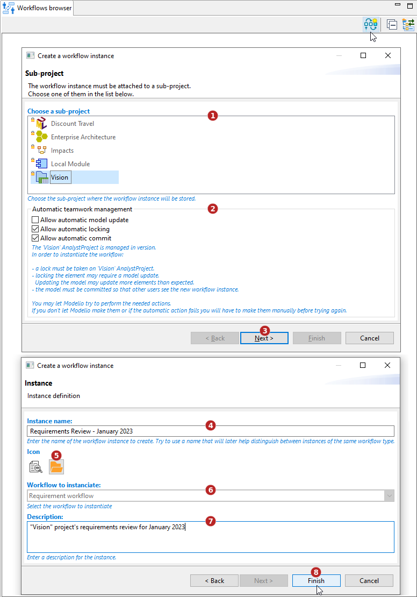

// Disable all captions for figures.
:!figure-caption:
// Path to the stylesheet files
:stylesdir: .

// Hightlight code source and add the line number
:source-highlighter: coderay
:coderay-linenums-mode: table

= Créer une instance de Workflow

Une instance de workflow est une occurrence particulière d'un workflow, définie par :

* Le type de workflow à appliquer (une définition de workflow)
* Les éléments qui font l'objet du workflow (voir <<Subscribe.adoc#,Inscrire au workflow...>>)
* Un nom et une description utilisés pour distinguer les instances de workflow.

Seul un utilisateur ayant la permission au niveau du projet Modelio Server d'effectuer la transition "Inscription au workflow" peut créer une instance.

=== Depuis l'<<WorkflowExplorer.adoc#,explorateur de workflow>>

Affichez la vue *Explorateur de workflow*, puis cliquez sur le bouton image:images/createinstanceicon.png[] *Créer une instance de workflow...*.

1. Sélectionnez le sous-projet auquel l'instance sera rattachée.
2. Si nécessaire, modifiez les options de gestion automatique du travail en équipe.
3. Cliquez sur "Suivant".
4. Entrez un nom pour l'instance de workflow à créer. Choisissez un nom significatif. +
_Par exemple si le workflow est une "Revue" et s'il est destiné à être utilisé pour réviser la version 2 d'un projet, nommer l'instance de workflow "Revue de la version 2" est probablement une bonne idée._
5. Sélectionnez une icône pour l'instance de workflow.
6. Sélectionnez un type de workflow parmi ceux proposés.
7. Entrez une description. Encore une fois, essayez d'ajouter une description pertinente et utile. +
_Dans notre exemple précédent "Revue de la version 2", une description telle que "Workflow utilisé pour gérer le processus de revue des exigences initiales de la version 2 du projet" est susceptible d'être utile_
8. Validez en cliquant sur "Terminer".