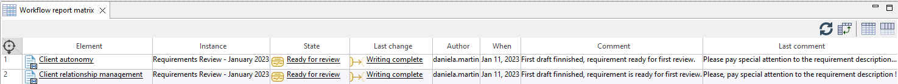

// Disable all captions for figures.
:!figure-caption:
// Path to the stylesheet files
:stylesdir: .

// Hightlight code source and add the line number
:source-highlighter: coderay
:coderay-linenums-mode: table

= Créer une matrice de rapport

Cette commande permet de créer une matrice listant tous les éléments inscrits à un workflow avec leur état courant, leur dernier commentaire, la date de dernière modification ainsi que leur dernière transition.

=== Depuis l'explorateur de modèle

Sélectionnez un élément éligible dont les sous-éléments sont inscrits dans un workflow puis lancez la commande *image:images/workflowicon.png[]Workflow > image:images/reporticon.png[]Créer un rapport* :

image::images/CreateReportMatrixCommand.png[]

Exemple de matrice de rapport :

Il est possible d'ajouter des éléments à la matrice en les glissant-déposant dans la colonne .

Notez aussi que le contenu de la matrice est rafraîchi à chaque ouverture pour garantir que les résultats affichés reflètent bien la situation réelle des éléments du workflow.
De plus, à tout moment, pendant l'affichage de la matrice, vous pouvez déclencher un rafraîchissement de son contenu en cliquant sur le bouton de mise à jour de la matrice  dans sa barre d'outils.
