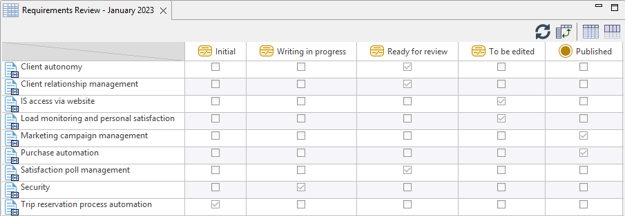

// Disable all captions for figures.
:!figure-caption:
// Path to the stylesheet files
:stylesdir: .

// Hightlight code source and add the line number
:source-highlighter: coderay
:coderay-linenums-mode: table

= Créer une matrice de synthèse

Cette commande permet de créer une matrice de synthèse listant tous les éléments du modèle inscrits à un workflow avec leur état courant.

=== Depuis l'<<WorkflowExplorer.adoc#,explorateur de workflow>>

Affichez la vue *Explorateur de workflow*, sélectionnez une instance puis lancez la commande *image:images/synthesisicon.png[]Créer une synthèse...*.

image::images/WorkflowSynthesisCommand.png[]
1. Choisissez un élément du modèle destiné à être propriétaire de la matrice de synthèse (le sous-projet auquel appartient l'instance de workflow est prédéfini dans ce champ).
2. Entrez un nom pour la matrice.
3. Cliquez sur "OK" pour créer la matrice.

Notez que le contenu de la matrice est rafraîchi à chaque ouverture pour garantir que les résultats affichés reflètent bien la situation réelle des éléments du workflow.
De plus, à tout moment, pendant l'affichage de la matrice, vous pouvez déclencher un rafraîchissement de son contenu en cliquant sur le bouton de mise à jour de la matrice image:images/RefreshMatrixContents16.png[] dans sa barre d'outils.

Exemple de matrice de synthèse de workflow :

