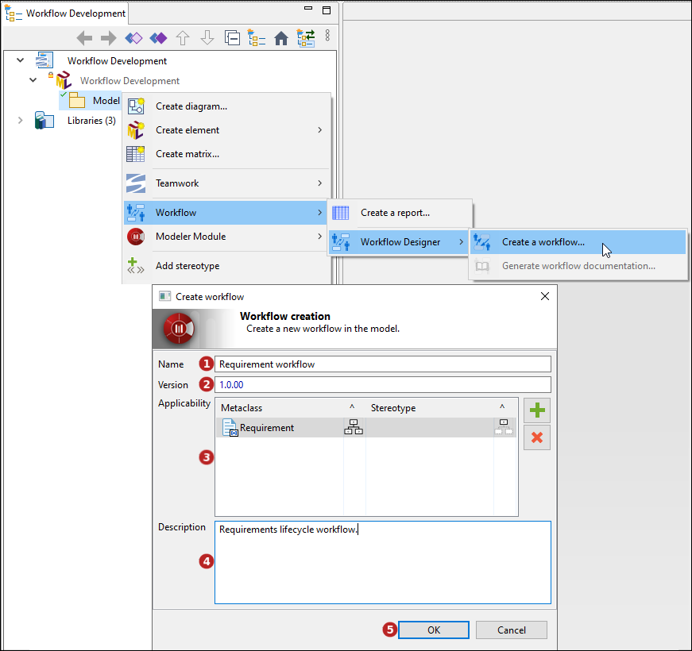
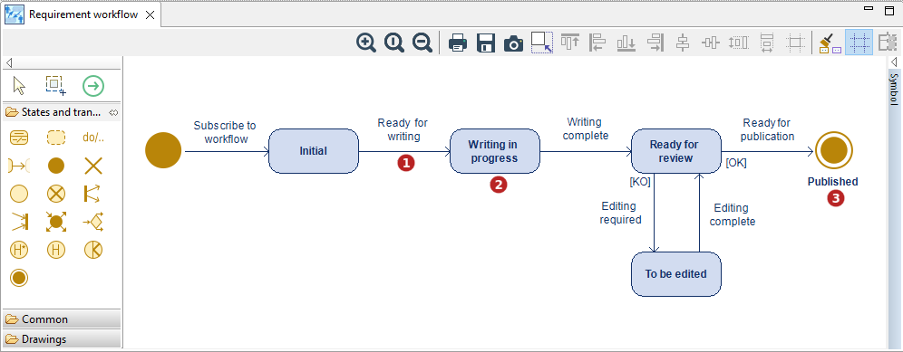

// Disable all captions for figures.
:!figure-caption:
// Path to the stylesheet files
:stylesdir: .

// Hightlight code source and add the line number
:source-highlighter: coderay
:coderay-linenums-mode: table

= Créer un workflow

Un workflow est un graphe avec des états et des transitions (voir la partie <<Concepts.adoc#,concepts>> ).

Un workflow ne peut être créé que sur un Package ou un Component.

Pour créer un workflow, sélectionnez un Package ou un Component et lancez la commande *image:images/workflowicon.png[]Workflow > image:images/workflowicon.png[]Créer un workflow...* :

1.  Saisissez le nom du workflow. Caractères autorisés : 'a' à 'z', 'A' à 'Z', '0' à '9', '.', '_' et ' '.
2.  Saisissez la version du workflow au format V.R.C.
3.  Indiquez le ou les types d'éléments pouvant être inscrits dans le workflow :
* Le champs 'Métaclasse' permet de définir la métaclasse (type d'élément) sur laquel le workflow peut être appliqué.
* L'option '^' permet de définir si le workflow peut être appliqué sur la métaclasse uniquement ou aussi sur ses sous-métaclasses.
* Le champs 'Stéréotype' permet de définir le stéréotype sur lequel le workflow peut être appliqué.
* L'option '^' permet de définir si le workflow peut être appliqué sur le stéréotype uniquement ou aussi sur ses sous-stéréotypes.
4.  Saisissez la description du workflow.
5.  Cliquez sur 'OK'.

La création du workflow a généré un diagramme de workflow contenant un pseudo-état et un état 'Initial', ces états sont nécessaires au fonctionnement du workflow, lorsqu'un élement est inscrit dans le workflow il passe à l'état 'Initial'.

image::images/WorkflowDiagram.png[]

Pour compléter le diagramme, il suffit de créer les états et les transitions souhaités, et de terminer le workflow par un état final :

1. Transition : Le nom de la transition doit évoquer l'action ou la condition qui permet le changement d'état. Il est conseillé d'y adjoindre une description via la <<WorkflowDesignerPropertyView.adoc#,vue Workflow>>.
3. Etat : Le nom de l'état doit être unique dans le workflow. Il est conseillé d'y adjoindre une description via la <<WorkflowDesignerPropertyView.adoc#,vue Workflow>>.
4. Etat final : Cet état termine le workflow.
