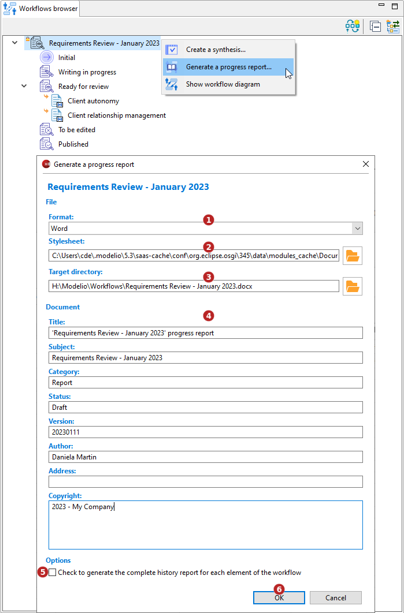

// Disable all captions for figures.
:!figure-caption:
// Path to the stylesheet files
:stylesdir: .

// Hightlight code source and add the line number
:source-highlighter: coderay
:coderay-linenums-mode: table

= Générer un rapport d'avancement

Cette commande nécessite que le module Document Publisher soit déployé dans le projet.

Elle permet de générer une documentation aux formats Docx, ODT, ou HTML.

=== Depuis l'<<WorkflowExplorer.adoc#,explorateur de workflow>>

Affichez la vue *Explorateur de workflow*, sélectionnez une instance puis lancez la commande *Générer un rapport d'avancement...*.

1.  Sélectionnez un format de génération : MS Word (.docx), Libre Office (.odt) ou HTML (.html).
2.  Sélectionnez un répertoire de génération.
3.  Sélectionnez une feuille de style. Il est possible d'utiliser une feuille de style personnalisée.
4.  Saisissez les propriétés du document.
5.  Historique des éléments : Tableaux listant les 8 dernières entrées de l'historique de chaque élément inscrit au workflow.
6.  Cliquer sur "OK" pour lancer la génération.
