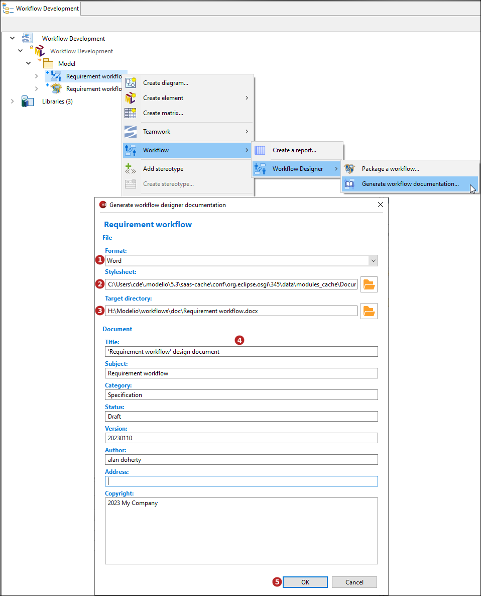

// Disable all captions for figures.
:!figure-caption:
// Path to the stylesheet files
:stylesdir: .

// Hightlight code source and add the line number
:source-highlighter: coderay
:coderay-linenums-mode: table

= Générer la documenation d'un workflow

Cette commande nécessite que le module Document Publisher soit déployé dans le projet.

Elle permet de générer une documentation du workflow aux formats Docx, ODT, ou HTML.

=== Depuis l'explorateur de modèle

Sélectionnez un workflow puis lancez la commande *image:images/workflowicon.png[]Workflow > image:images/workflowicon.png[]Workflow Designer > image:images/gendocicon.png[]Générer la documentation du workflow...*.

1.  Sélectionnez un format de génération : MS Word (.docx), Libre Office (.odt) ou HTML (.html).
2.  Sélectionnez un répertoire de génération.
3.  Sélectionnez une feuille de style. Il est possible d'utiliser une feuille de style personnalisée.
4.  Saisissez les propriétés du document.
6.  Cliquer sur "OK" pour lancer la génération.
