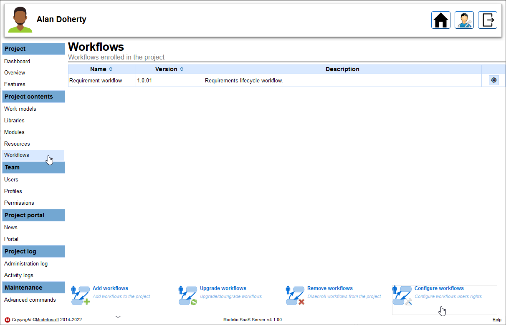

// Disable all captions for figures.
:!figure-caption:
// Path to the stylesheet files
:stylesdir: .

// Hightlight code source and add the line number
:source-highlighter: coderay
:coderay-linenums-mode: table

= Configuration des permissions et des notifications

Après avoir <<AddWorkflowToProject.adoc#,ajouter le workflow dans votre projet>> , les permissions et les notifications doivent être configurées. Elles sont basées sur les profils. Il est donc recommandé d'avoir plusieurs profils afin d'avoir une certaine finesse sur les droits.

Toutes ces configurations s'effectuent depuis le portail de configuration du projet.

Pour configurer vos workflows, veuillez suivre la procédure suivante :

* Connectez-vous au serveur en tant qu'administrateur du projet, puis cliquez sur le bouton *Configurer* du projet :

image::images/ConfigureProject.png[]

* Allez dans la section *Contenu du projet > Workflows* puis cliquez sur le bouton *Configurer les workflows* : 

* Sélectionnez le workflow à configurer et établissez ses permissions et ses notifications pour chaque transition :

image::images/ConfigureWokflowsRights.png[]

Dans l'exemple ci-dessus, nous voyons que le profil "Managers" est le seul à pouvoir effectuer la transition "Subscribe to workflow" qui consiste à passer un élément de l'état "Subscription request" à l'état "Initial". Nous voyons également qu'un mail sera envoyé à tous les membres du projet lorsqu'une livraison d'éléments passés à l'état "Initial" aura lieu.

Le "Manager" peut aussi effectuer la transition "Ready for writing" qui consiste à passer un élément de l'état "Initial" à l'état "Writing in progress". Cette fois-ci le mail de notification ne sera envoyé qu'aux membres du projet concernés par l'état suivant de l'élément, c'est à dire "Writing in progress", qui comme indiqué dans la ligne suivante ne concerne que les "writers".

Les "Writers" sont les seuls à pouvoir effectuer les transitions "Writing complete" et "Editing complete". Lorsque ces transitions seront effectuées les "Reviewers" seront notifiés par mail puisqu'ils sont les concernés par les états suivants ces transitions.

Les "Reviewers" peuvent quant à eux effectuer les transitions "Editing required" et "Ready for publication" qui seront notifiées respectivement aux "Writers" et à tous les membres du projet.
