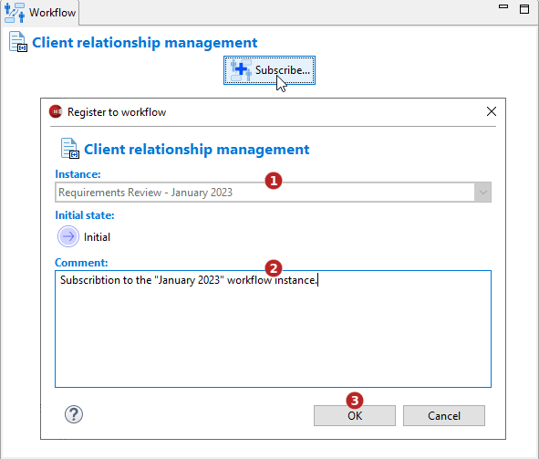

// Disable all captions for figures.
:!figure-caption:
// Path to the stylesheet files
:stylesdir: .

// Hightlight code source and add the line number
:source-highlighter: coderay
:coderay-linenums-mode: table

= Inscrire un élément au workflow

Pour qu'un élément soit géré en workflow, il doit y être inscrit.

Un élément ne peut être inscrit dans un workflow que si ce dernier est configuré pour être applicable sur ce type d'élément.
Seul un utilisateur ayant la permission au niveau du projet Modelio Server d'effectuer la transition "Inscription au workflow" peut y inscrire un élément.

Une <<CreateInstance.adoc#,instance du workflow>> doit avoir été créé sur le projet.

=== Depuis l'explorateur de modèle

Sélectionnez un élément éligible puis lancez la commande *image:images/workflowicon.png[]Workflow > Inscrire...* :

image::images/SubscribeCommand.png[SubscribeCommand.png]

1.  Sélectionnez une instance dans laquelle inscrire l'élément.
2.  Saisissez un commentaire. Par exemple la raison pour laquelle cet élément doit être inscrit dans le workflow.
4.  Cliquez sur "OK".

=== Depuis la <<WorkflowUserPropertyView.adoc#,vue Workflow>>

Sélectionnez un élément éligible puis cliquez sur le bouton *Inscrire...* :

1.  Sélectionnez une instance dans laquelle inscrire l'élément.
2.  Saisissez un commentaire. Par exemple la raison pour laquelle cet élément doit être inscrit dans le workflow.
4.  Cliquez sur "OK".