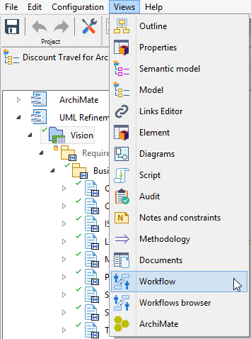
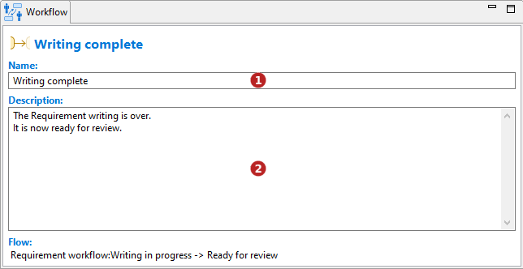

// Disable all captions for figures.
:!figure-caption:
// Path to the stylesheet files
:stylesdir: .

// Hightlight code source and add the line number
:source-highlighter: coderay
:coderay-linenums-mode: table

= Vue Workflow

Modelio Workflow fournit une vue dédiée qui peut être activée depuis le menu Modelio *Vues* :

La vue Workflow est contextuelle à l'élément sélectionné.

Sur un <<CreateWorkflow.adoc#,*Workflow*>> :

image::images/WorkflowDesignerView.png[]

1.  Nom du workflow. Caractères autorisés : 'a' à 'z', 'A' à 'Z', '0' à '9', '.', '_' et ' '.
2.  Version du workflow au format V.R.C.
3.  Types d'éléments pouvant être inscrits dans le workflow :
* Le champs 'Métaclasse' permet de définir la métaclasse (type d'élément) sur laquel le workflow peut être appliqué.
* L'option '^' permet de définir si le workflow peut être appliqué sur la métaclasse uniquement ou aussi sur ses sous-métaclasses.
* Le champs 'Stéréotype' permet de définir le stéréotype sur lequel le workflow peut être appliqué.
* L'option '^' permet de définir si le workflow peut être appliqué sur le stéréotype uniquement ou aussi sur ses sous-stéréotypes.
4.  Description du workflow.

Sur un *état* :

image::images/StateWorkflowView.png[]

1.  Nom de l'état. Il doit être unique dans le workflow.
2.  Description de l'état. Elle doit décrire à quoi correspond cet état pour l'élément inscrit dans le workflow.

Sur une *transition* :

1.  Nom de la transition. Il doit évoquer l'action ou la condition qui permet le changement d'état.
2.  Description de la transition. Elle doit décrire l'action ou la condition qui permet le changement d'état. Elle peut aussi décrire les permissions nécessaires pour être effectuée.

