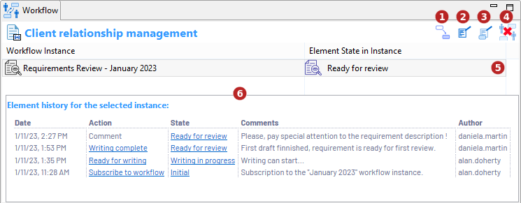

// Disable all captions for figures.
:!figure-caption:
// Path to the stylesheet files
:stylesdir: .

// Hightlight code source and add the line number
:source-highlighter: coderay
:coderay-linenums-mode: table

= Vue workflow

Modelio Workflow fournit une vue dédiée qui peut être activée depuis le menu Modelio *Vues* :

image::images/WorkflowViewMenu.png[]

La vue Workflow est contextuelle à l'élément sélectionné.

Sur un élément <<Subscribe.adoc#,inscrit>> à un workflow :

1. <<ChangeState.adoc#,Modifier l'état de l'élément sélectionné.>>
2. <<AddComment.adoc#,Ajouter un commentaire à l'élément sélectionné.>>
3. <<EditLastComment.adoc#,Modifier le dernier commentaire de l'élément sélectionné.>>
4. <<Unsubscribe.adoc#,Désinscrire l'élément sélectionné de l'instance de workflow.>>
5. Sélectionner l'instance de workflow (si l'élément est inscrit dans plusieurs instance).
6. Historique de l'élément sélectionné par rapport l'instance sélectionnée.
